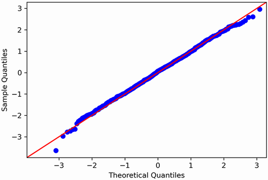
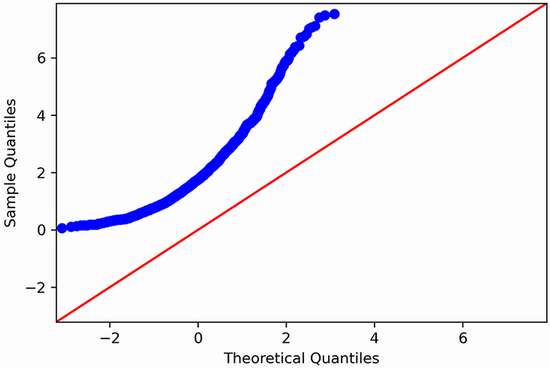

# Machine Learning 101

## Day 8

### XGBoost

- Hyper-paramters equivalent from native XGBoost interface (`xgboost.train()`) to the Scikit-learn interface (`xgboost.XGBRegressor`, `xgboost.XGBClassifier`)
  - `eta` &#8594; `learning_rate`
  - `lambda` &#8594; `reg_lambda`
  - `alpha` &#8594; `reg_alpha`
  - `num_boost_round` &#8594; `n_estimators`: are the number of boosting rounds (trees) and they are functionally equivalent, but for different APIs:
    - Use `n_estimators` for the Scikit-learn interface (`xgboost.XGBRegressor`, `xgboost.XGBClassifier`).
    - Use `num_boost_round` for the native XGBoost interface (`xgboost.train()`)

## Day 7

### Stratified sampling

- For example, the US population is 51.1% females and 48.9% males, so a well-conducted survey, say select 1,000 people that are representative of the whole U.S population, we would try to maintain this ratio in the sample: 511 females and 489 males (at least if it seems possible that the answers may vary across genders).
- This is called stratified sampling: the population is divided into homogeneous subgroups called `strata`, and the right number of instances are sampled from each stratum to guarantee that the test set is representative of the overall population.

```Python
#  experts who told you that the median income (income_cat) is a very important attribute to predict median housing prices
strat_train_set, strat_test_set = train_test_split(
    df, test_size=0.2, stratify=df["income_cat"], random_state=42)
```

### Model Evaluation

- Regression: Residual Normality
- Classification: Decile Analysis, Cumulative Gains and Lift Curves

#### Regression

##### Confidence Interval of the Error

```Python
# compute a 95% confidence interval for the generalization error using scipy.stats.bootstrap().
# Defines a helper function to compute RMSE from squared errors.
def rmse_func(squared_errors):
    return np.sqrt(np.mean(squared_errors))

confidence = 0.95
squared_errors = (y_pred - y_test) ** 2
# It performs bootstrap resampling on the squared_errors data (i.e., repeatedly samples with replacement).
# Each resample is used to compute an RMSE via rmse_func function.
boot_result = stats.bootstrap([squared_errors], rmse_func,
                              confidence_level=confidence, random_state=42)
# After many iterations (by default, 9999), it calculates the confidence interval of the RMSE distribution.
rmse_lower, rmse_upper = boot_result.confidence_interval

print(f"95% CI for RMSE: [{rmse_lower:.4f}, {rmse_upper:.4f}]")

```

## Day 6

### RFM

#### BG-NBD Model

##### Problem with `conditional_probability_alive()` for case when frequency=0

- [Issue](https://github.com/CamDavidsonPilon/lifetimes/issues/165): There is a problem with BG-NBD model's `conditional_probability_alive()` is that for users that have no frequency (one-time purchasers), the prob_alive is always 1 or $P(alive | freq=0) = 1$.
- Solution: The [ModifiedBetaGeo](https://github.com/CamDavidsonPilon/lifetimes/blob/master/lifetimes/fitters/modified_beta_geo_fitter.py) model "fixes" this by giving a non trivial probability to those with a single purchase. We can see what this means by looking at the code for conditional_probability_alive.

## Day 5

### SHAP - Explainability

- SHAP is the most powerful Python package for understanding and debugging your models.
- SHAP value's Understanding:
  - For regression, SHAP value is interpreted as
    $$f(x)=E[f(x)] + \text{SHAP values}$$
  - For classification, SHAP value is interpreted as
    - **Log odds of the positive class** for the **binary** targets:
      $$f(x) = f(ln({\frac{P}{1-P}})) = E[ln({\frac{P}{1-P}})] + \text{SHAP values}$$
    - **Soft max** for the **multi-class** targets: need to softmax the $f(x)$ values for each class to get the original prediction probabiliy.
  - Note:
    - $E[f(x)]$ gives the average value of all the prediction.
    - $f(x)$ gives the predicted value for a particular observation

## Day 4

### Data Pre-processing

#### Scaling vs Normalising

- Scaling and normalization can be confusing terms for data scientists, as they are often used interchangeably.
- **Scaling**: the data affects only its _scale_ and _not its distribution_.
  - It simply forces the values into a certain range
- **Normalizing**: affects its distribution and its scale & would force it to have a normal distribution or a Gaussian distribution.
  - Normalizing the data is only useful when the models we use require the data to be normal.
  - For example, linear discriminant analysis (LDA) is derived from the assumption of a normal distribution, so it is better to normalize data before using LDA.

### EDA

- To check a feature follows the normal distribution, we can use Q-Q plot.

#### Quantile Quantile (Q-Q) plots

- The quantile-quantile (Q-Q) plot is a graphical method for determining if a dataset follows a certain probability distribution or whether two samples of data came from the same population or not.
  - Q-Q plots are particularly useful for assessing whether a dataset is normally distributed or if it follows some other known distribution.

```Python

import numpy as np
import matplotlib.pyplot as plt
import scipy.stats as stats

# Generate example of normal distribution data
np.random.seed(0)
data = np.random.normal(loc=0, scale=1, size=1000)

# Create Q-Q plot
stats.probplot(data, dist="norm", plot=plt)
plt.title('Normal Q-Q plot')
plt.xlabel('Theoretical quantiles')
plt.ylabel('Ordered Values')
plt.grid(True)
plt.show()
```

| Q-Q plot of a dataset that is very close to a normal distribution |    Q-Q plot of a dataset that is not close to a normal distribution.     |
| :---------------------------------------------------------------: | :----------------------------------------------------------------------: |
|       |  |

- The Q-Q plot is constructed by plotting the quantiles of our residuals on the y-axis against the quantiles of a theoretical distribution, in this case the normal distribution, on the x-axis.
  - If both distributions are similar, meaning that the distribution of the residuals is close to a normal distribution, the Q-Q plot will display a straight line that approximately lies on $y = x$.
  - If both distributions are not similar, meaning that the distribution of the residuals is not close to a normal distribution, the Q-Q plot will generate the curve that departs from $y = x$.

## Day 3

### Modeling

- Tree-based models do not require the data in the same scale.
- Result Reproducibility: validate **mean** performance and **variance** of the model based on **different random seeds**. :star: Higher variance means lower robustness. :star:

### Ensemble Methods

- `Voting Ensemble` works by combining the predictions from multiple models.
  - In the case of **regression**, this involves calculating the average of the predictions from the models.
  - In the case of **classification**, the predictions for each label are summed and the label with the majority vote is predicted.
    - **Hard Voting** - Predict the class with the largest sum of votes from models
    - **Soft Voting** - Predict the class with the largest summed probability from models.

```Python
# voting example: regression
predictions = np.mean([model.predict(X_test_pre)[: ,1] for model in models], axis=0)
```

```Python
# voting example: classification
from sklearn.ensemble import VotingClassifier

# Linear model (logistic regression)
lr = LogisticRegression(warm_start=True, max_iter=400)
# RandomForest
rf = RandomForestClassifier()
# XGB
xgb = XGBClassifier(tree_method="hist", verbosity=0, silent=True)
# Ensemble
lr_xgb_rf = VotingClassifier(estimators=[('lr', lr), ('xgb', xgb), ('rf', rf)],
                             voting='soft')
```

### Evaluation Metrics

#### Classification

- `auc` (Area under curve) performs well with the **imbalanced** data in the classification problem.
- [**Closeness Evaluation Measure**](https://hoxuanvinh.netlify.app/blog/2024-05-17-closeness-evaluation-metric/?fbclid=IwZXh0bgNhZW0CMTEAAR09uFev_5pMlhYSJaGJTH_TZmiv0szH5AJ81vxhIFTBYDXxyAx-Y0wRHOo_aem_AdSZfIZi6JnCvTIKl3rmQLRWJ8yKwiaGOaYRBHrDNA4j991-xjxRj1YGsaM0SncAqXbMZa_nOIbVdQWLLZru7l7l) used for ordinal classification which is a type of classification task whose predicted classes (or categories) have a specific ordering.

##### Multi-Class Classification

- `merror` – Multiclass classification error rate
- `mlogloss` – Multiclass logloss

#### Regression

- **Mean Absolute Percentage Error (MAPE)**: a measure of prediction accuracy for forecasting methods that is easy to interpret and **independent of the scale of our data** (either two-digit values or six-digit values)
  - Drawback: we cannot use MAPE if the series contains 0-value it is impossible to calculate the percentage difference from an observed value of 0 because that implies a division by 0.
- **Mean Squared Error (MSE) or Root MSE**:
  - In case the series contains 0-value, so we are unable to use MAPE, so MSE is a good option.
  - When to use: In case the prediction range is small (0.1 or 1), and we want to **amplify the error** using MSE
  - How to know if the MSE is good or bad ?
    - For example, for the random walk series with the range varies from -30 to 30. The best forecast produces the MSE exceeds 300. This is an extremely high value considering that our random walk dataset does not exceed the value of 30.
- **Mean Absolute Error (MAE)**: an easy metrics to interpret, as it returns the average of the absolute difference between the predicted and actual values, instead of a squared difference like the **MSE**.
  - When to use: In case the data have quite a number of long tails, the model prediction is far off actual values for certain data points, then if we use MSE or RMSE, square such errors giving the resulted metrics are very high, and it might not reflect the entire holdout set error.
  - For example, `MAE=2765` means that the actual prediction will be either above or below the actual value around $2765

### Sklearn's ColumnTransformer

- The `make_column_transformer()` is not recommended to use for building the pipeline as the default naming might not reflect the actual underlying transformation
  - In below example, we know that `Age` column is processed by pipeline-1 via the transformed column's name `pipeline-1__Age`. However, we do not know what is the transformation method has been applied to the `Age` column, which in this case is bining

```Python
make_column_transformer(
            (binning_pipeline(n_bins=5, encode='onehot', bin_strategy='quantile'), ['Age']),
            (binning_pipeline(n_bins=7, encode='ordinal', bin_strategy='kmeans'), ['CreditScore']),
            (oh_cat_pipeline, ['Geography', 'Gender', 'HasCrCard', 'IsActiveMember']),
            (ord_cat_pipeline, ['Tenure', 'NumOfProducts']),
            (geo_gender_pipeline, ['Geography', 'Gender']), # feature engineering
            remainder=num_pipeline
)
# ['pipeline-1__Age_0.0', 'pipeline-1__Age_1.0',
#        'pipeline-1__Age_2.0', 'pipeline-1__Age_3.0',
#        'pipeline-1__Age_4.0', 'pipeline-2__CreditScore',
#        'pipeline-3__Geography_France', 'pipeline-3__Geography_Germany',
#        'pipeline-3__Geography_Spain', 'pipeline-3__Gender_Female',
#        'pipeline-3__Gender_Male', 'pipeline-3__HasCrCard_0.0',
#        'pipeline-3__HasCrCard_1.0', 'pipeline-3__IsActiveMember_0.0',
#        'pipeline-3__IsActiveMember_1.0', 'pipeline-4__Tenure',
#        'pipeline-4__NumOfProducts', 'pipeline-5__GeoGender_FranceFemale',
#        'pipeline-5__GeoGender_FranceMale',
#        'pipeline-5__GeoGender_GermanyFemale',
#        'pipeline-5__GeoGender_GermanyMale',
#        'pipeline-5__GeoGender_SpainFemale',
#        'pipeline-5__GeoGender_SpainMale', 'remainder__Balance',
#        'remainder__EstimatedSalary']

################ Best Practise for ColumnTransformer ################
ColumnTransformer([
                ("bin_oh",binning_pipeline(n_bins=5, encode='onehot', bin_strategy='quantile'), ['Age']),
                ("bin_ord", binning_pipeline(n_bins=7, encode='ordinal', bin_strategy='kmeans'), ['CreditScore']),
                #(oh_cat_pipeline, make_column_selector(dtype_include='category')),
                ("cat_oh", oh_cat_pipeline, ['Geography', 'Gender', 'HasCrCard', 'IsActiveMember']),
                ("cat_ord",ord_cat_pipeline, ['Tenure', 'NumOfProducts']),
                ("concat", geo_gender_pipeline, ['Geography', 'Gender'])  # feature engineering
            ],
            remainder=num_pipeline
)

# ['bin_oh__Age_0.0', 'bin_oh__Age_1.0', 'bin_oh__Age_2.0',
#        'bin_oh__Age_3.0', 'bin_oh__Age_4.0', 'bin_ord__CreditScore',
#        'cat_oh__Geography_France', 'cat_oh__Geography_Germany',
#        'cat_oh__Geography_Spain', 'cat_oh__Gender_Female',
#        'cat_oh__Gender_Male', 'cat_oh__HasCrCard_0.0',
#        'cat_oh__HasCrCard_1.0', 'cat_oh__IsActiveMember_0.0',
#        'cat_oh__IsActiveMember_1.0', 'cat_ord__Tenure',
#        'cat_ord__NumOfProducts', 'concat__GeoGender_FranceFemale',
#        'concat__GeoGender_FranceMale', 'concat__GeoGender_GermanyFemale',
#        'concat__GeoGender_GermanyMale', 'concat__GeoGender_SpainFemale',
#        'concat__GeoGender_SpainMale', 'remainder__Balance',
#        'remainder__EstimatedSalary']
```

### Sklearn's Pipeline

- `SelectFromModel` transformer based on the feature importance of `RandomForestRegressor` before the final regressor:

```Python
from sklearn.feature_selection import SelectFromModel

selector_pipeline = Pipeline([
    ('preprocessing', preprocessing),
    ('selector', SelectFromModel(RandomForestRegressor(random_state=42),
                                 threshold=0.005)),  # min feature importance score
    ('svr', SVR(C=rnd_search.best_params_["svr__C"],
                gamma=rnd_search.best_params_["svr__gamma"],
                kernel=rnd_search.best_params_["svr__kernel"])),
])
```

### Hyperparameter Tuning

- Tips: increase the number of folds in the cross-validation method during Hyperparameter Tuning (for the big dataset) can achieve the higher accuracy

#### Grid Search

- Notice that the value of `C` is the maximum tested value. When this happens you definitely want to launch the grid search again with higher values for `C` (removing the smallest values), because it is likely that higher values of `C` will be better.

```Python
# params: 'svr__C': [1.0, 3.0, 10., 30., 100., 300., 1000.0]
# best hyper-params
grid_search.best_params_ # {'svr__C': 10000.0, 'svr__kernel': 'linear'}
```

#### Optuna

- `TPESampler` (Tree-structured Parzen Estimator Sampler) is a smarter way of selecting hyperparameters compared to **random** search.
  - Instead of picking parameters randomly, it uses Bayesian Optimization to sample promising hyperparameter sets based on past trials.
  - `n_startup_trials=n_startup_trials`: The first n_startup_trials use random search (to explore different regions of the parameter space). After that, TPESampler exploits the best-performing areas.

```Python
# Optuna study
study = optuna.create_study(
    direction="minimize",  # We want to minimize RMSE
      # uses Bayesian Optimization to sample promising hyperparameter sets based on past trials.
    sampler=optuna.samplers.TPESampler(seed=42,
                                        # The first n_startup_trials use random search (to explore different regions of the parameter space).
                                        n_startup_trials=n_startup_trials),
)
study.optimize(objective, n_trials=n_trial)
```

### Vocab

- `Stochastics`: randomness
  - For example: k-means is a stochastic algorithm, meaning that it relies on randomness to locate the clusters
- `Homogeneous` homo- means “same.”
- `Heterogeneous` hetero- means “different” or “other.”

### EDA

- The basic metric for location is the `mean`, but it can be **sensitive to extreme values (outlier)**.
- Other metrics (`median`, `trimmed mean`) are **less sensitive to outliers and unusual distributions** and hence are more robust.
- The **median** is the same thing as the **50th percentile**.

#### Plots

- **Violin plot** is an enhancement to the boxplot, show nuances (sac thai) in the distribution
- **Boxplot** is to show the outliers in the data

#### Correlation

- Like the mean and standard deviation, the **correlation coefficient** is **sensitive** to **outliers** in the data.
- Pearson’s correlation coefficient always lies between

  - $+1$ perfect positive correlation
  - $–1$ perfect negative correlation
  - $0$ indicates no correlation.

- NOTE: Variables can have an association that is **not linear**, in which case the correlation coefficient may not be a useful metric.
  - For example: . The relationship between tax rates and revenue raised is an example: as tax rates increase from zero, the revenue raised also increases. However, once tax rates reach a high level and approach 100%, tax avoidance increases and tax revenue actually declines.

## Day 2

### Pandas

- `pd.cut` to divide the data into multiple range

```Python
# If right == True (the default), then the bins [1, 2, 10**6, float('inf')]
#                              indicate (1,2], (2,3], (10**6, float('inf')].
# This argument is ignored when bins is an IntervalIndex.
mapping = pd.cut(make_df['mean'], [0, 10**4, 2.5*(10**4), 3.6*(10**4), 5.5*(10**4), 10**5, 10**6, float('inf')],
        labels=['low', ' mid-1', 'mid-2', 'high-class', 'luxury' ,'super luxury', 'exotic'], right=True)

# make_category = {
#     'exotic': (10**6, float('inf')],
#     'super luxury': (10**5, 10**6],
#     'luxury': (5.5*(10**4), 10**5],
#     'high-class': (3.6*(10**4), 5.5*(10**4)],
#     'mid-2': (2.5*(10**4), 3.6*(10**4)],
#     'mid-1': (10**4, 2.5*(10**4)],
#     'low'  : (0, 10**4]
# }
```

### Scikit-learn

- `.fit()`, `.transform()`, `.predict()` needs to provide as `[[1], [2], [1], ..]` format
  - Solution:
    - **Method 1** using reshape: `[1,2,1].reshape(-1, 1)` or `ohe.fit_transform(df['col'].values.reshape(-1, 1))`
    - **Method 2** using `[[]]`: `model.fit(df[['col']].values)`
- `UserWarning: X does not have valid feature names, but IsolationForest was fitted with feature name`
  - Root Cause: this happens when we `.fit()`the model/encoder/sklearn object with DataFrame, but when we `.predict()` with Numpy array
  - Solution: `.fit(df.values)` so that we will provide to the sklearn object the Numpy array

### Numpy

- Convert sparse matrix (only store position of where has value != 0) to dense: `sparse_matrix.to_array()`
  - FYI: the matrix returns after one-hot encoding is a spare matrix

## Day 1

### Dimensionality Reduction Techniques

- PCA
- t-SNE
- MCA

### Data Pre-processing

#### Outlier Removal

- For the right-skew dataset where There are an extreme increase from the 99th percentile (2.2363) to the 100th (196)percentile, we can define IQR range = Q3 (quantile=0.99) - Q1 (quantile=0.01), instead of Q3=0.75 and Q1=0.25

```Python
# count    7933.000000
# mean        0.125359
# std         2.602527
# min         0.000000
# 0%          0.000000
# 5%          0.000000
# 50%         0.000000
# 95%         0.000000
# 99%         2.233600
# 100%      196.010000
# max       196.010000


class OutlierHandler():
    def __init__(self):
        pass
    def get_outlier_thresholds(self, df, col_name, lower_quantile=0.25, upper_quantile=0.75):
        """
        Calculate the lower and upper outlier thresholds for a given variable in the dataframe.

        Parameters:
            dataframe (pandas.DataFrame): The dataframe containing the variable.
            variable (str): The name of the variable for which outlier thresholds will be calculated.

        Returns:
            tuple: A tuple containing the lower and upper outlier thresholds.
        """
        quartile_1 = df[col_name].quantile(lower_quantile)
        quartile_3 = df[col_name].quantile(upper_quantile)
        interquantile_range = quartile_3 - quartile_1
        up_limit = quartile_3 + 1.5 * interquantile_range
        low_limit = quartile_1 - 1.5 * interquantile_range
        return low_limit.round(), up_limit.round()


    def replace_with_thresholds(self, df, col_name, low_limit, up_limit):
        """
        Replace the outliers in the given variable of the dataframe with the lower and upper thresholds.

        Parameters:
            dataframe (pandas.DataFrame): The dataframe containing the variable.
            variable (str): The name of the variable for which outliers will be replaced.

        Returns:
            None
        """
        df.loc[(df[col_name] < low_limit), col_name] = low_limit
        df.loc[(df[col_name] > up_limit), col_name] = up_limit
        return df
out_handler = OutlierHandler()
# set the IQR range from 0.01 to 0.99 instead of 0.25 to 0.75 percentile
low_limit, up_limit = out_handler.get_outlier_thresholds(df, "REVENUE", lower_quantile=0.01, upper_quantile=0.99)
print(low_limit, up_limit)
df = out_handler.replace_with_thresholds(df, "REVENUE", low_limit, up_limit )
```

#### Scaler

- There are two common ways to get all attributes to have the same scale:

  - Min-max Scaling (a.k.a Normalization): &#8594; Range (0 & 1)

    - This is performed by subtracting the min value and dividing by the difference between the min and the max.
    - It has a feature_range hyperparameter that lets you change the range.

    ```Python
    from sklearn.preprocessing import MinMaxScaler

    min_max_scaler = MinMaxScaler(feature_range=(-1, 1))
    housing_num_min_max_scaled = min_max_scaler.fit_transform(housing_num)
    ```

  - Standardization: it subtracts the mean value (so standardized values have a zero mean), then it divides the result by the standard deviation (so standardized values have a standard deviation equal to 1)
    - Unlike min-max scaling, standardization does not restrict values to a specific range. However, standardization is much less affected by outliers.

- Note 1: NO need to scale those are One-Hot encoded
- Note 2: While the training set values will always be scaled to the specified range, if new data contains outliers, these may end up scaled outside the range.
  - If you want to avoid this, just set the `clip` hyperparameter to `True`
- Note 3: Neural networks work best with zero-mean inputs, so the scaled range of –1 to 1 is preferable

#### Categorical Feature

##### Encoding

- If a categorical attribute has a large number of possible categories (e.g., country code, profession, species), then one-hot encoding will result in a large number of input features.
- Solution:
  - For example, a country code could be replaced with the country’s population and GDP per capita).
  - Alternatively, you can use one of the encoders provided by the category_encoders package on GitHub such as:
    - Hash Encoder: for `state`, `city` columns
  - When dealing with neural networks, you can replace each category with a learnable, low-dimensional vector called an embedding. This is an example of representation learning (see Chapters [13](https://learning.oreilly.com/library/view/hands-on-machine-learning/9781098125967/ch13.html#data_chapter) and [17](https://learning.oreilly.com/library/view/hands-on-machine-learning/9781098125967/ch17.html#autoencoders_chapter) for more details).

##### Rare Category

- A **rare category** is a category which is not seen very often, or a new category that is not present in train
- Define our criteria for calling a value **RARE**. Let’s say the requirement for a value being rare in this column is a count of less than 2000
- Wherever the value count for a certain category is less than 2000, replace it with rare. So, now, when it comes to test data, all the new, unseen categories will be mapped to **RARE**, and all missing values will be mapped to **NONE**.

### Model Training

- Split Train, Val, Test with 60-20-20

```Python
# Train, Test, Val Splits
X_train, X_test, y_train, y_test = train_test_split(X, y, random_state=42, shuffle=True, test_size=0.2)

X_train, X_val, y_train, y_val = train_test_split(X_train, y_train, random_state=42, shuffle=True, test_size=0.25) # 0.25 x 0.8 = 0.2
```

- Usually, split into train & test sets.
  - For train set, can use cross-validation to perform the hyper-paramter tuning
    - Note 1: if Poor test generalization after tuning, Revert to default hyper-parameters.

#### Regression

- Target variable: as the y has a wide range, so better to convert to log scale before training

```Python
y_train = np.log1p(df_train.price.values)
y_val   = np.log1p(df_val.price.values)
y_test  = np.log1p(df_test.price.values)
```

#### Binary Classification

- If the target is **skewed** (class 0 dominates class 1) &#8594; the best metric for this binary classification problem would be `Area Under the ROC Curve (AUC)`.
  - We can use precision and recall too, but AUC combines these two metrics.
