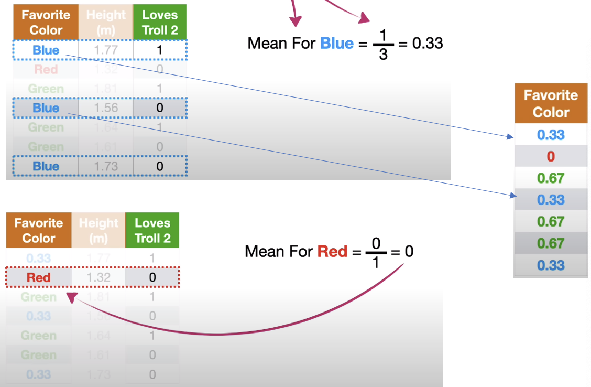
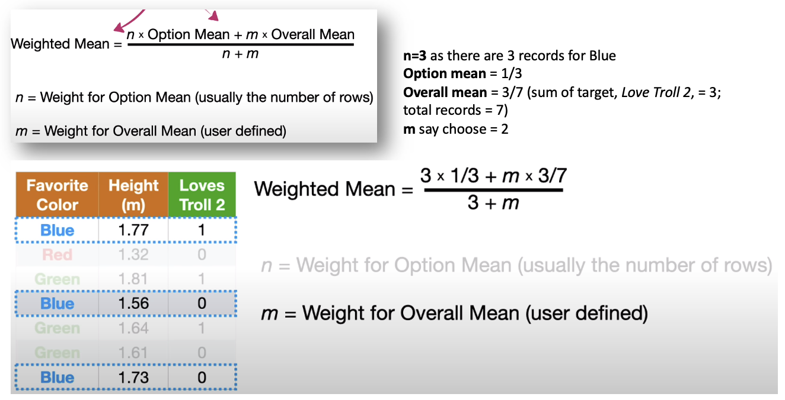
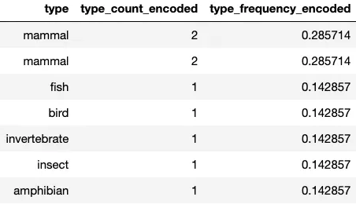
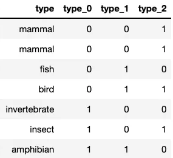
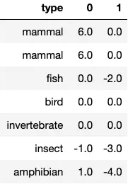

# Categorical Encoding

## Type of Categorical Variables
- Categorical Variables: 
    - **Nomial**: no order associated with like gender (male & female) &#8594; using Label Encoder or Mapping Dictionary
    - **Ordinal**: order associated
    - **Cyclical**: Monday > Tuesday > .. > Sunday
    - **Binary**: only has 0 and 1
    - **Rare Category**:  a category which is not seen very often, or a new category that is not present in train
## Rule of Thumbs
- Rule 1: Fill na with string &#8594; convert all values to string
    - `data[feat].fillna("Other").astype(str)`
- Rule 2:  A **rare category** is a category which is not seen very often, or a new category that is not present in train
    - Define our criteria for calling a value “rare” category, so for those categorical which have the count less than certain threshold during the training we can map it to "rare" category
```Python
# below code is to find those categories in col "ord_4" which have the count less then 2000, and assign them to the same category "rare"
df.loc[df["ord_4"].map(df["ord_4"].value_counts()) < 2000, "ord_4"] = "RARE"
```
- The map on how to determine which encoder we should use

<p align="center"></p>

## Type of Encoders

| Encoder              | Type of Variable | Support High Cardinality | Handle Unseen | Task | Cons |
| :------------------- | :--------------: | :----------------------: |:-------------:|:-------------:| :-------------|
| Label Encoding       |   Nominal        |     Yes                  | No            |      |   |
| Ordinal Encoding     |   Ordinal        |     Yes                  | Yes           |      |   |
| One-Hot Encoding     |   Nominal        |     Not                  | Yes           |      | Large Dataset |
| Target Encoding / Leave One Out Encoding | Nominal | Yes                    | Yes           | Only Classification   | Target Leakage & Un-even Category Distribution |
| Count / Frequency Encoding | Nominal | Yes                    | Yes           |   | Similar encodings for categories with the same counts|
| Binary / BaseN Encoding | Nominal | Yes                    | Yes           |   | |
| Hash Encoding | Nominal | Yes                    | Yes           |   | Irreversible & Information Loss  |

## Label Encoding / Ordinal Encoding
- **Label Encoder** is used for *nominal* categorical variables (categories without order i.e., red, green, blue)
    - Only encode one column at a time and multiple label encoders must be initialized for each categorical column.
- **Ordinal Encoder** is used for *ordinal* categorical variables (categories with order i.e., small, medium, large).
    - If not specify the order when initialise the Ordinal Encoder, it is equivalent to Label Encoder

```Python
df.loc[:, "ord_2"] = df["ord_2"].fillna("Other")
# Label Encoder Example
from sklearn.preprocessing import LabelEncoder
lbl_enc = LabelEncoder()
lbl_enc.fit(df["ord_2"].values)

df.loc[:,"ord_2"] = lbl_enc.transform(df["ord_2"].values)
# getting the mapping
lbl_mapping = dict(zip(lbl_enc.classes_, lbl_enc.transform(lbl_enc.classes_)))
# {'Boiling Hot': 0, 'Cold': 1, 'Freezing': 2, 'Hot': 3, 'Lava Hot': 4, 'Other': 5, 'Warm': 6}


# Ordinal Encoder Example
ordinal_enc = OrdinalEncoder(
    categories=[["Freezing", "Warm", "Cold", "Boiling Hot", "Hot", "Lava Hot"]], # specify the order 0,1,2,3,4,5
    handle_unknown="use_encoded_value",
    unknown_value=-1, # unknown value will be mapped to -1
)
ordinal_enc.fit(df["ord_2"].values)

df.loc[:,"ord_2"] = ordinal_enc.transform(df["ord_2"].values)
encoded_categories = ordinal_enc.transform(ordinal_enc.categories_[0].reshape(-1, 1))
ordinal_mapping = dict(zip(ordinal_encoder.categories_[0], encoded_categories.squeeze()))
# {'Freezing': 0.0, 'Warm': 1.0, 'Cold': 2.0, 'Boiling Hot': 3.0, 'Hot': 4.0, 'Lava Hot': 5.0}
```

## One Hot Encoding
- Given that the cardinality (number of categories) is `n`, One-Hot Encoder encodes the data by creating `n` additional columns.

```Python
df.loc[:, "ord_2"] = df["ord_2"].fillna("Other")

ohe = preprocessing.OneHotEncoder(handle_unknown='ignore')
ohe.fit(df['ord_2'].values.reshape(-1, 1))

# Fit encoder on training data (returns a separate DataFrame)
data_ohe = pd.DataFrame(ohe.transform(df[["ord_2"]].values).toarray())
data_ohe.columns = [col for col in ohe.categories_[0]]

#    Boiling Hot  Cold  Freezing  Hot  Lava Hot  Other  Warm
# 0          0.0   0.0       0.0  1.0       0.0    0.0   0.0
# 1          0.0   0.0       0.0  0.0       0.0    0.0   1.0
# 2          0.0   0.0       1.0  0.0       0.0    0.0   0.0

# for unknow value, will result in all 0s vector
ohe.transform([['Unseen']]).toarray()
#     array([[0.,  0.,       0.,   0.,        0.,    0.,   0.]])
```

## Target Encoding / Leave One Out Encoding
- Target Encoding uses Bayesian posterior probability to encode categorical variables to the mean of the target variable (numerical variable). 
- There are two ways to implement target encoding
    - **Mean Encoding**: The encoded values are the mean of the target values with smoothing applied
    - **Leave-One-Out Encoding**: The encoded values are the mean of the target values except for the data point that we want to predict
### Target (Mean) Encoding 
- Example: we want to encode **"Favorite Color"** column with the target column **"Loves Troll 2"**
<p align="center"></p>

- From above example, because less data supports the value Red (only 1 record), so we have less confidently placed the encoded value for Red in compare with Blue and Green
- The solution for this is **Weigthed Mean** with the smoothing `m`
<p align="center"></p>

- Code Implementation
```Python
import category_encoders as ce

# Target (Mean) Encoding - fit on training data, transform test data
encoder = ce.TargetEncoder(cols=["ord_2"], smoothing=1.0)
df["ord_2_encoded"] = encoder.fit_transform(df["ord_2"], df["target"])

```
#### Cons of Target Encoder
- *Target Leakage*: Even with smoothing, this may result in target leakage and overfitting. Leave-One-Out Encoding and introducing Gaussian noise in the target variable can be used to address the overfitting problem
- *Uneven Category Distribution*: The category distribution can differ in train and validation/test data and result in categories being encoded with incorrect or extreme values

### Leave One Out Encoding
- In the leave one out encoding, the current target value is reduced from the overall mean of the target to avoid leakage.
- For example, we want to encode the column `ord_2` and we have 
    - At the index 0, the `ord_2` has the category `Hot` corresponding to `target = 0`
    - At the index 9, the `ord_2` has the category `Lava Hot` corresponding to `target = 1`

|    | ord_2   |   ord_2_encoded |   target |
|---:|:--------|----------------:|---------:|
|  0 | Hot     |        0.205179 |        0 |
|  9 | Lava Hot |       0.290751 |        1 |

- For each category in the `ord_2` column, let calculate what is the count & the target sum accordingly

```Python
df.groupby('ord_2')['target'].agg(['count', 'sum'])
```

| ord_2       |   count |   sum |
|:------------|--------:|------:|
| Boiling Hot |   84790 | 20689 |
| Cold        |   97822 | 14889 |
| Freezing    |  142726 | 18876 |
| Hot         |   67508 | 13851 |
| Lava Hot    |   64840 | 18853 |
| Other       |   18075 |  3373 |
| Warm        |  124239 | 21792 |

- For `row_id = 0`, Hot will be encoded as `(13851 - 0) / (67508-1) = 0.205179`
- For `row_id = 9`, Lava Hot will be encoded as `(18853 - 1) / (64840-1) = 0.29075`

## Count / Frequency Encoding
- Count and Frequency Encoding encodes categorical variables to the count of occurrences and frequency (normalized count) of occurrences respectively.
- Cons: Similar encodings 
    - If all categories have similar counts, the encoded values will be the same
```Python
import category_encoders as ce

# Count Encoding - fit on training data, transform test data
encoder = ce.CountEncoder(cols="type")
data_train["type_count_encoded"] = encoder.fit_transform(data_train["type"])
data_test["type_count_encoded"] = encoder.transform(data_test["type"])

# Frequency (normalized count) Encoding
encoder = ce.CountEncoder(cols="type", normalize=True)
data_train["type_frequency_encoded"] = encoder.fit_transform(data_train["type"])
data_test["type_frequency_encoded"] = encoder.transform(data_test["type"])

```
<p align="center"></p>

## Binary / BaseN Encoding
- **Binary Encoding** encodes categorical variables into integers, then converts them to binary code. The output is similar to One-Hot Encoding, but lesser columns are created.
- This addresses the drawback to One-Hot Encoding where a cardinality of n does not result in `n` number of columns, but `log2(n)` columns. 
- **BaseN Encoding** follows the same idea but uses other base values instead of 2, resulting in `logN(n)` columns.
- Pros: 
    - **Nominal Variables**: Binary and BaseN Encoder are used for nominal categorical variables
    - **High Cardinality**: Binary and BaseN encoding works well with a high number of categories
    - **Missing or Unseen Variables**: Binary and BaseN Encoder can handle unseen variables by encoding them with 0 values across all columns
```Python
import category_encoders as ce

# Binary Encoding - fit on training data, transform test data
encoder = ce.BinaryEncoder()
data_encoded = encoder.fit_transform(data_train["type"])
encoder.transform(data_test["type"])

# BaseN Encoding - fit on training data, transform test data
encoder = ce.BaseNEncoder(base=5)
data_encoded = encoder.fit_transform(data_train["type"])
encoder.transform(data_test["type"])
```

<p align="center"></p>

## Hash Encoding
- Hash Encoding encodes categorical variables into distinct hash values using a hash function. The output is similar to One-Hot Encoding, but you can choose the number of columns created.
- Hash encoding can encode high-cardinality data to a fixed-sized array as the number of new columns is manually specified.
- Pros:
    - **Nominal Variables**: Hash Encoder is used for nominal categorical variables
    - **High Cardinality**: Hash encoding works well with a high number of categories
    - **Missing or Unseen Variables**: Hash Encoder can handle unseen variables by encoding them with null values across all columns
- Cons:
    - **Irreversible**: Hashing functions are one-direction such that the original input can be hashed into a hash value, but the original input cannot be retrieved from the hash value
    - **Information Loss** or **Collision**: If too few columns are created, hash encoding can lead to loss of information as multiple different inputs may result in the same output from the hash function
- Hash encoding can be done with `FeatureHasher` from the **sklearn** package or with `HashingEncoder` from the **category encoders** package.

```Python
from sklearn.feature_extraction import FeatureHasher

# Hash Encoding - fit on training data, transform test data
encoder = FeatureHasher(n_features=2, input_type="string")
data_encoded = encoder.fit_transform(data_train["type"]).toarray()

# Using category_encoders
import category_encoders as ce

# Hash Encoding - fit on training data, transform test data
encoder = ce.HashingEncoder(n_components=2)
data_encoded = encoder.fit_transform(data_train["type"])
```

<p align="center"></p>