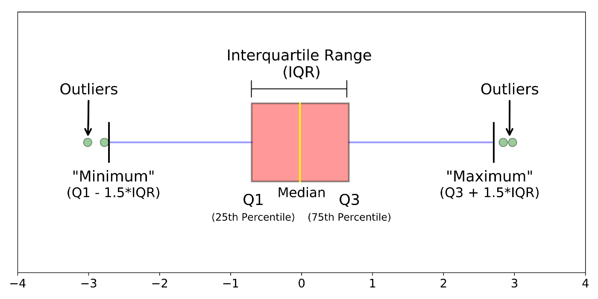
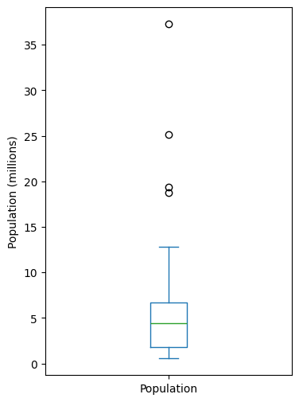
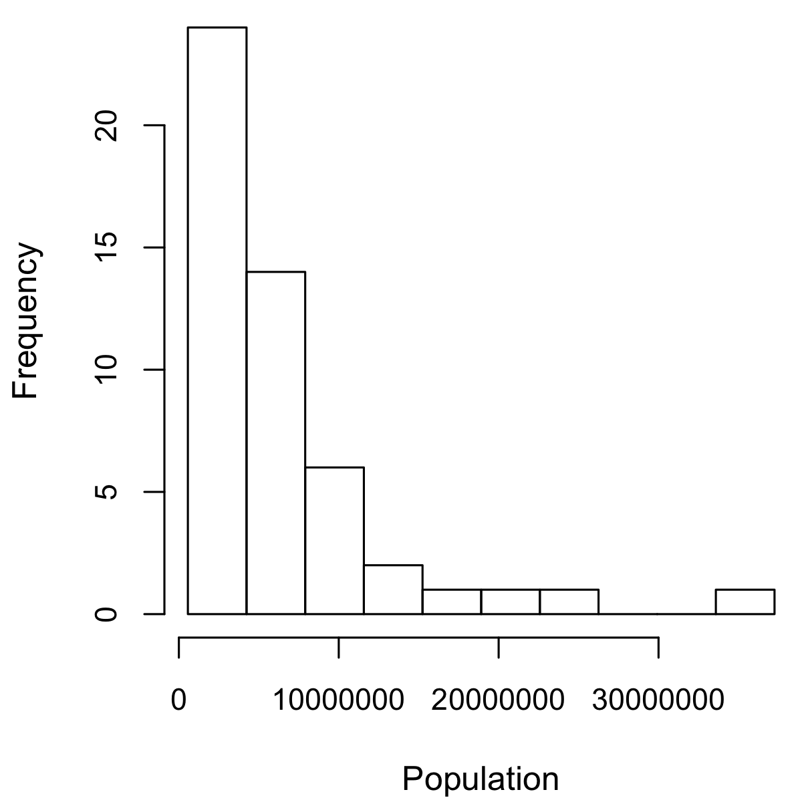
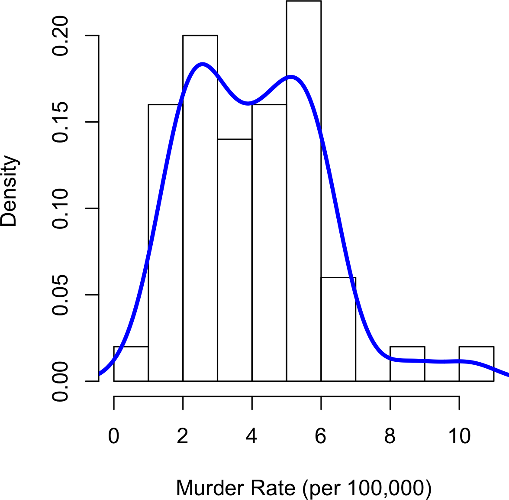
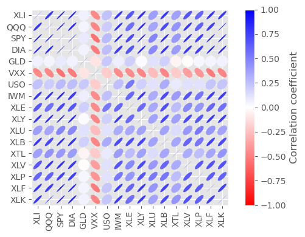

# Exploratory Data Analysis (EDA)

- The first step in any data science project: exploring the data.
- In statistical theory,
  - **Location** and **Variability** are referred to as the first and second moments of a distribution.
  - **Skewness** and **Kurtosis** are called as the third and fourth moments
    - Skewness refers to whether the data is skewed to larger or smaller values
    - Kurtosis indicates the propensity of the data to have extreme values.

## 1. Elements of Structured Data

- There are two basic types of structured data: numeric and categorical.
- **Numeric**: Data that are expressed on a numeric scale.
  - **Continuous**: Data that can take on any value in an interval. (Synonyms: interval, float, numeric)
  - **Discrete**: Data that can take on only integer values, such as counts. (Synonyms: integer, count)
- **Categorical**: Data that can take on only a specific set of values representing a set of possible categories. (Synonyms: enums, enumerated, factors, nominal)
  - **Binary**: A special case of categorical data with just two categories of values, e.g., 0/1, true/false. (Synonyms: dichotomous, logical, indicator, boolean)
  - **Ordinal**: Categorical data that has an explicit ordering. (Synonym: ordered factor)

## 2. Exploring Numerical Data

### 2.1. Estimates of Location

- A basic step in exploring your data is getting an estimate of where most of the data is located (i.e., its **central tendency**).

#### 2.1.1. Mean (Average)

- **Mean** is the sum of all values divided by the number of values.
  $$\text{Mean} = \bar x = \frac{\sum_{i=1}^n x_i}{n}$$

##### 2.1.1.1. Trimmed mean

- A variation of the mean is a trimmed mean
  $$\text{Trimmed Mean}= \bar x = \frac{\sum_{i=p+1}^{n-p} x_i}{n-2p}$$

##### 2.1.1.2. Weighted mean

- Weighted mean, which you calculate by multiplying each data value $x_i$ by a user-specified weight $w_i$ and dividing their sum by the sum of the weights.
  $$\text{Weighted Mean}= \bar x_w = \frac{\sum_{i=1}^{n} w_i x_i}{\sum_{i=1}^{n} w_i}$$

- For example: If we want to compute the average murder rate for the country, we need to use a weighted mean or median to account for different populations in the states.

```Python
np.average(state['Murder.Rate'], weights=state['Population']) # weight used here is population of each state
```

#### 2.1.2. Median

- The median is the middle number on a sorted list of the data.
- The median is referred to as a **robust estimate of location** since it is not influenced by outliers (extreme cases) that could skew the results
- When outliers are the result of bad data, the mean will result in a poor estimate of location, while the median will still be valid.

### 2.2. Estimates of Variability

- Location is just one dimension in summarizing a feature.
  A second dimension, **variability**, also referred to as `dispersion`, measures whether the data values are tightly clustered or spread out.

#### 2.2.1. Deviation

- Deviations tell us how dispersed the data is around the central value.

##### 2.2.1.1. Mean Absolute Deviation

- Mean absolute deviation and is computed with the formula where $\bar x$ is the sample mean

$$\text{Mean Absolute Deviation}= \frac{\sum_{i=1}^{n} |x_i - \bar x|}{n}$$

- For example: a set of data {1, 4, 4}, the mean is 3 and the median is 4. The deviations from the mean are the differences: 1 – 3 = –2, 4 – 3 = 1, 4 – 3 = 1.
  - The absolute value of the deviations is {2 1 1}, and their average is (2 + 1 + 1) / 3 = 1.33.

##### 2.2.1.2. Variance & Standard Deviation (MAD)

- The best-known estimates of variability are the variance and the standard deviation, which are based on _squared deviations_.
- The **variance** is an average of the squared deviations
  $$\text{Variance} = s^2 = \frac{\sum_{i=1}^{n} (x_i - \bar x )^2}{n-1}$$
- The **standard deviation** is the square root of the variance - The standard deviation is much easier to interpret than the variance since it is on the same scale as the original data
  $$\text{Standard Deviation} = s = \sqrt{\text{Variance}}$$

#### 2.2.2. Estimates Based on Percentiles

- A different approach to _estimating dispersion_ is based on the spread of the sorted data.
- The most basic measure is the **range**: the difference between the largest and smallest numbers.
  - The _minimum_ and _maximum_ values themselves are useful to know and are helpful in identifying outliers, but the range is extremely sensitive to outliers and **not very useful as a general measure of dispersion (range) in the data**.
- To avoid the sensitivity to outliers, we can look at the range of the data after dropping values from each end.
- `Pth percentile` is a value such that at least $P$ percent of the values take on this value or less and at least $(100 – P)$ percent of the values take on this value or more.
  - For example: to find the 80th percentile, sort the data.
    - Then, starting with the smallest value, proceed 80 percent of the way to the largest value.
    - Note: the median is the same thing as the 50th percentile.
  - The percentile is essentially the same as a quantile, with quantiles indexed by fractions (so the .8 quantile is the same as the 80th percentile).
- `Interquartile Range` (or `IQR`) is a common measurement of variability is the difference between the **25th percentile** and the **75th percentile**
  - For example: we have an array {3,1,5,3,6,7,2,9}.
    - We sort these to get {1,2,3,3,5,6,7,9}.
    - The 25th percentile is at 2.5, and the 75th percentile is at 6.5, so the interquartile range is 6.5 – 2.5 = 4.

```Python
state['Population'].quantile(0.75) - state['Population'].quantile(0.25)
```

### 2.3. Exploring the Data Distribution

- Each of the estimates sums up the data in a single number to describe the location or variability of the data.
- It is also useful to explore how the data is distributed overall.
  - A **frequency histogram** plots frequency counts on the y-axis and variable values on the x-axis
    - It gives a sense of the distribution of the data at a glance.
  - A **frequency table** is a tabular version of the frequency counts found in a histogram.
  - A **boxplot** with the top and bottom of the box at the 75th and 25th percentiles, respectively—also gives a quick sense of the distribution of the data
    - It is often used in side-by-side displays to compare distributions.
  - A **density plot** is a smoothed version of a histogram; it requires a function to estimate a plot based on the data (multiple estimates are possible, of course).

#### 2.3.1. Percentiles and Boxplots

- Percentiles are also valuable for summarizing the entire distribution

<p align="center"></p>

```Python
ax = (state['Population'] / 1_000_000).plot.box(figsize=(4,6))
ax.set_ylabel('Population (millions)')
plt.show()
```

<p align="center"></p>

- Understand the box plot:
  - The top and bottom of the box are the 75th (7M people) and 25th (2M people) percentiles
  - The median (5M people) is shown by the horizontal line in the box.
  - The dashed lines, referred to as **whiskers**, extend from the top and bottom of the box to indicate the range for the bulk of the data
  - Any data outside of the whiskers is plotted as single points or circles (often considered **outliers**).

#### 2.3.2. Frequency Tables and Histograms

##### Frequency Tables

- A frequency table of a variable divides up the variable range into equally spaced segments and tells us how many values fall within each segment
- For example: The function `pandas.cut` creates a series that maps the values into the segments.
  - The least populous state is Wyoming, with 563,626 people, and the most populous is California, with 37,253,956 people.
  - This gives us a range of 37,253,956 – 563,626 = 36,690,330, which we must divide up into equal size bins—let’s say 10 bins.
  - With 10 equal size bins, each bin will have a width of 3,669,033, so the first bin will span from $(0.527M, 4.233M]$

```Python
binnedPopulation = pd.cut(state['Population'], 10)
```

| binnedPopulation | count | States                                                                                                                                           |
| :--------------- | ----: | :----------------------------------------------------------------------------------------------------------------------------------------------- |
| (0.527, 4.233]   |    24 | ['AK', 'AR', 'CT', 'DE', 'HI', 'ID', 'IA', 'KS', 'ME', 'MS', 'MT', 'NE', 'NV', 'NH', 'NM', 'ND', 'OK', 'OR', 'RI', 'SD', 'UT', 'VT', 'WV', 'WY'] |
| (4.233, 7.902]   |    14 | ['AL', 'AZ', 'CO', 'IN', 'KY', 'LA', 'MD', 'MA', 'MN', 'MO', 'SC', 'TN', 'WA', 'WI']                                                             |
| (7.902, 11.571]  |     6 | ['GA', 'MI', 'NJ', 'NC', 'OH', 'VA']                                                                                                             |
| (11.571, 15.24]  |     2 | ['IL', 'PA']                                                                                                                                     |
| (15.24, 18.909]  |     1 | ['FL']                                                                                                                                           |
| (18.909, 22.578] |     1 | ['NY']                                                                                                                                           |
| (22.578, 26.247] |     1 | ['TX']                                                                                                                                           |
| (26.247, 29.916] |     0 | []                                                                                                                                               |
| (29.916, 33.585] |     0 | []                                                                                                                                               |
| (33.585, 37.254] |     1 | ['CA']                                                                                                                                           |

##### Histogram

- A histogram is a way to visualize a frequency table, with bins on the x-axis and the data count on the y-axis.

```Python
ax = (state['Population'] / 1_000_000).plot.hist(figsize=(4, 4))
ax.set_xlabel('Population (millions)')
plt.show()
```

<p align="center"></p>

- Understand the histogram:
  - Empty bins are included in the graph.
  - Bins are of equal width.
  - The number of bins (or, equivalently, bin size) is up to the user.
  - Bars are contiguous — no empty space shows between bars, unless there is an empty bin.

#### 2.3.3. Density Plots and Estimates

- A **density plot** can be thought of as a _smoothed_ histogram, although it is typically computed directly from the data through a _kernel density estimate_
- Note: that the total area under the density curve = 1

```Python
ax = state['Murder.Rate'].plot.hist(density=True,     # y-axis as density instead of count
                                    xlim=[0,12],
                                    bins=range(1,12)) # set bin range from 1 to 12
state['Murder.Rate'].plot.density(ax=ax)
ax.set_xlabel('Murder Rate (per 100,000)')
plt.show()
```

<p align="center"></p>

### 2.4. Outliers

- An **outlier** is any value that is very distant from the other values in a data set.

## 3. Exploring Binary and Categorical Data

- For categorical data, simple proportions or percentages tell the story of the data.
- Key concepts:
  - **Mode**: The most commonly occurring category or value in a data set.
  - **Expected value**: When the categories can be associated with a numeric value, this gives an average value based on a category’s probability of occurrence.
  - **Bar chart**: The frequency or proportion for each category plotted as bars.

### 3.1. Bar Chart (Histogram for Categorical Data)

- A bar chart resembles a histogram; in a bar chart the x-axis represents different categories of a factor variable, while in a histogram the x-axis represents values of a single variable on a numeric scale.
- Getting a summary of a binary variable or a categorical variable with a few categories is a fairly easy matter: we just figure out the proportion of 1s, or the proportions of the important categories.

```Python
df_cat['nom_0'].value_counts(normalize=True).plot.bar(figsize=(6,3)) # normalise to get the proportion of each category

plt.tight_layout()
plt.show()
```

### 3.2. Mode

- The mode is the value—or values in case of a tie—that appears most often in the data.
- The mode is a simple summary statistic for categorical data, and it is generally not used for numeric data.
- For example: in most parts of the United States, the mode for religious preference would be Christian

### 3.3. Expected Value

- The expected value is calculated as follows:
  - Multiply each outcome by its probability of occurrence.
  - Sum these values.
- Expected value is a fundamental concept in business valuation and capital budgeting
- For example: the marketer firm figures that 5% of the attendees will sign up for the $300 service, 15% will sign up for the $50 service, and 80% will not sign up for anything.
  - The expected value of a webinar attendee is thus $22.50 per month, calculated as follows:
$$EV = (0.05)*(300) + (0.15)*50 + (0.8)*0 = 22.5$$

## 4. Multivariate Analysis

### 4.1. Two Numerical Variables (Correlation)

- EDA in many modeling projects involves examining correlation **among predictors**, and **between predictors and a target variable**.
- **Positively correlated** if high values of X go with high values of Y, and low values of X go with low values of Y.
- **Negatively correlated** if high values of X go with low values of Y, and vice versa.
- Key concepts:
  - **Correlation coefficient**: A metric that measures the extent to which numeric variables are associated with one another (ranges from –1 to +1).
  - **Correlation matrix (Pearson’s correlation) & Heatmap**: A table where the variables are shown on both rows and columns, and the cell values are the correlations between the variables.
  - **Scatterplot**: A plot in which the x-axis is the value of one variable, and the y-axis the value of another.
  - Like the mean and standard deviation, the correlation coefficient is **sensitive to outliers** in the data.

#### 4.1.1 Correlation coefficient

- Pearson’s correlation coefficient always lies between

  - $+1$ perfect positive correlation
  - $–1$ perfect negative correlation
  - $0$ indicates no correlation.
    $$
    r = \frac{{}\sum_{i=1}^{n} (x_i - \overline{x})(y_i - \overline{y})}
    {(n-1)\sqrt{\sum_{i=1}^{n} (x_i - \overline{x})^2  \sum_{i=1}^{n}(y_i - \overline{y})^2}}
    $$

- Variables can have an association that is **not linear**, in which case the correlation coefficient may not be a useful metric.
  - For example: The relationship between tax rates and revenue raised is an example: as tax rates increase from zero, the revenue raised also increases. However, once tax rates reach a high level and approach 100%, tax avoidance increases and tax revenue actually declines.

#### 4.1.2. Correlation matrix (Pearson’s correlation) & Heatmap

**Heatmap**

```Python
def plot_heatmap(df_corr, title):
  _, ax = plt.subplots(figsize=(8,6))

  # ones_like can build a matrix of booleans (True, False) with the same shape as our data
  ones_corr = np.ones_like(df_corr, dtype=bool)
  # np's triu: return only upper triangle matrix
  mask = np.triu(ones_corr)
  # When removing the upper tri-angle, here are still two empty cells in our matrix (calories & vitamin)
  adjusted_mask = mask[1:, :-1]
  adjusted_df_corr = df_corr.iloc[1:, :-1]

  sns.heatmap(data=adjusted_df_corr, mask=adjusted_mask,
              annot=True, annot_kws={"fontsize":12}, fmt=".2f", cmap='Blues',
              vmin=-1, vmax=1,
              linecolor='white', linewidths=0.5);

  yticks = [i.upper() for i in adjusted_df_corr.index]
  xticks = [i.upper() for i in adjusted_df_corr.columns]

  ax.set_yticklabels(yticks, rotation=0, fontsize=10);
  ax.set_xticklabels(xticks, rotation=90, fontsize=10);
  title = f'CORRELATION MATRIX\n{title.upper()}\n'
  ax.set_title(title, loc='left', fontsize=14)
  plt.tight_layout()
  plt.show()

plot_heatmap(df_corr, 'Rollover Coaster Features')
```

**Corr Ellipses**

- The orientation of the ellipse indicates whether two variables are _positively correlated (ellipse is pointed to the top right_) or _negatively correlated (ellipse is pointed to the top left)_.
- The **shading** and **width** of the ellipse indicate the strength of the association: **thinner** and **darker** ellipses correspond to **stronger** relationships.

<p align="center"></p>

- Understanding the corr ellipse plot:
  - _High Correlation_: The ETFs for the S&P 500 (SPY) and the Dow Jones Index (DIA) have a high correlation.
    - Similarly, the QQQ and the XLK, composed mostly of technology companies, are positively correlated
  - _Weekly or Negative Correlation_: Defensive ETFs, such as those tracking gold prices (GLD), oil prices (USO), or market volatility (VXX), tend to be weakly or negatively correlated with the other ETFs.

```Python
from matplotlib.collections import EllipseCollection
from matplotlib.colors import Normalize

def plot_corr_ellipses(data, figsize=None, **kwargs):
    ''' https://stackoverflow.com/a/34558488 '''
    M = np.array(data)
    if not M.ndim == 2:
        raise ValueError('data must be a 2D array')
    fig, ax = plt.subplots(1, 1, figsize=figsize, subplot_kw={'aspect':'equal'})
    ax.set_xlim(-0.5, M.shape[1] - 0.5)
    ax.set_ylim(-0.5, M.shape[0] - 0.5)
    ax.invert_yaxis()

    # xy locations of each ellipse center
    xy = np.indices(M.shape)[::-1].reshape(2, -1).T

    # set the relative sizes of the major/minor axes according to the strength of
    # the positive/negative correlation
    w = np.ones_like(M).ravel() + 0.01
    h = 1 - np.abs(M).ravel() - 0.01
    a = 45 * np.sign(M).ravel()

    ec = EllipseCollection(widths=w, heights=h, angles=a, units='x', offsets=xy,
                           norm=Normalize(vmin=-1, vmax=1),
                           transOffset=ax.transData, array=M.ravel(), **kwargs)
    ax.add_collection(ec)

    # if data is a DataFrame, use the row/column names as tick labels
    if isinstance(data, pd.DataFrame):
        ax.set_xticks(np.arange(M.shape[1]))
        ax.set_xticklabels(data.columns, rotation=90)
        ax.set_yticks(np.arange(M.shape[0]))
        ax.set_yticklabels(data.index)

    return fig, ec, ax

fig, m, ax = plot_corr_ellipses(etfs.corr(), figsize=(6, 4), cmap='bwr_r') #cmap='Greens', cmap='bwr_r'
cb = fig.colorbar(m, ax=ax)
cb.set_label('Correlation coefficient')

plt.tight_layout()
plt.show()
```

#### 4.1.3 Scatter Plot & Pairplot

- The standard way to visualize the relationship between two measured data variables is with a scatterplot.
- Pairplot is to plot multiple pair-wise scatterplot

```Python
# scatter plot via df.plot()
ax = telecom.plot.scatter(x='T', y='VZ', figsize=(4, 4), marker='$\u25EF$')
ax.set_xlabel('ATT (T)')
ax.set_ylabel('Verizon (VZ)')
ax.axhline(0, color='grey', lw=1)
ax.axvline(0, color='grey', lw=1)

# pair-plot
sns.pairplot(df,
             vars=['Col A','Col B',
                   'Col C','Col D'
                  ],
              hue='Col Target')
plt.show()
```
