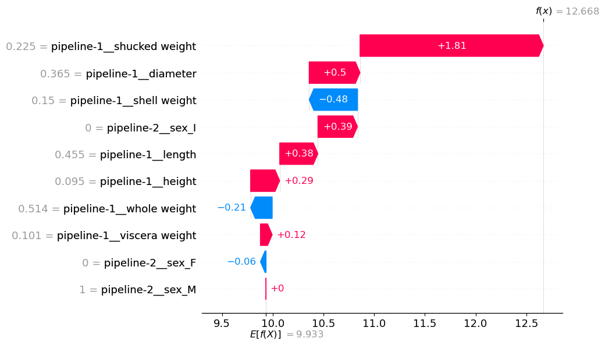
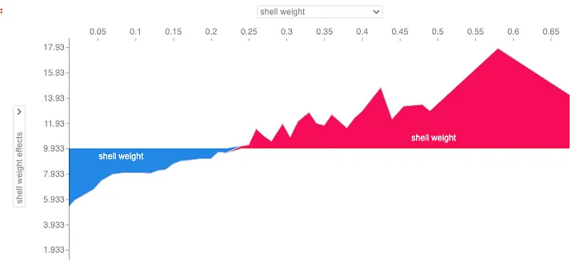
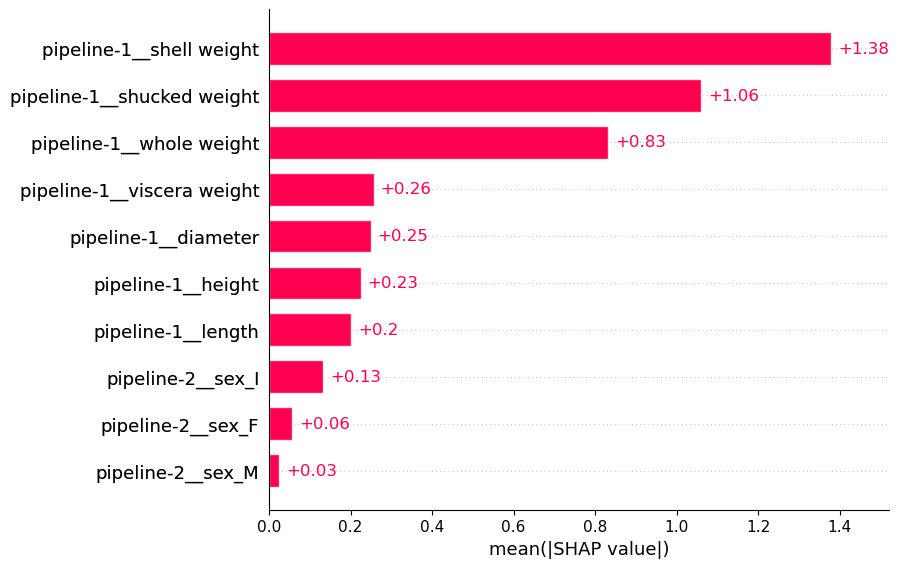
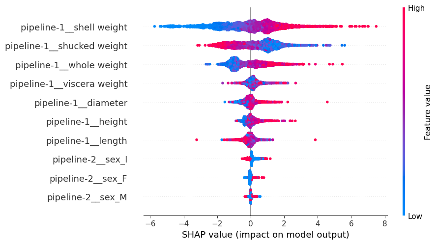
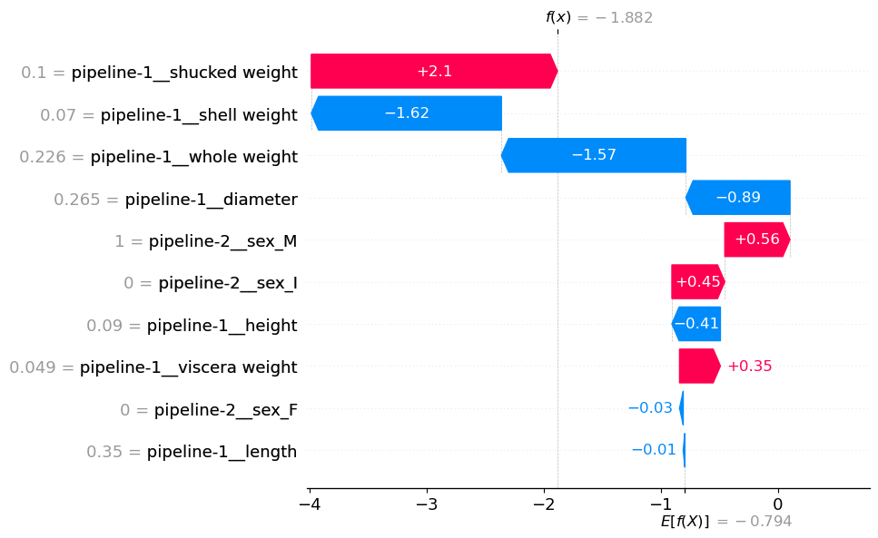
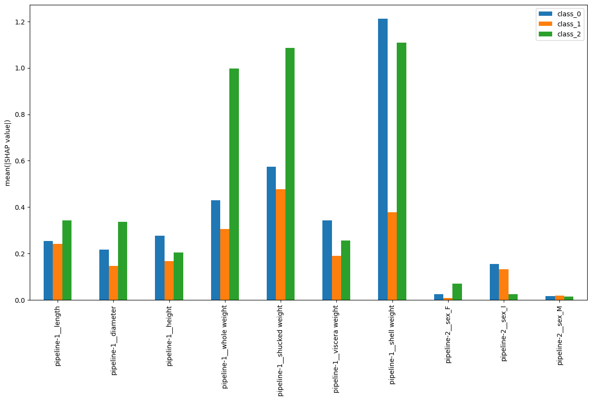
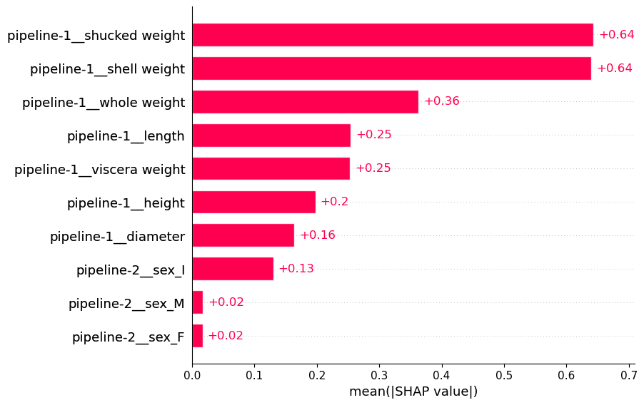
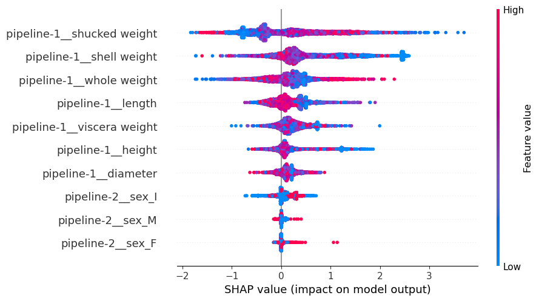

# SHAP

## Introduction

- SHAP (SHapley Additive exPlanations), originally created in 2017, has been designed, using the game theory, to identify what is the marginal contribution of each feature within the model.
- SHAP is the most powerful Python package for understanding and debugging your models.
- Explain the SHAP for a single prediction $f(x)$
  - For regression, SHAP value is interpreted as
    $$f(x)=E[f(x)] + \text{SHAP values}$$
  - For classification, SHAP value is interpreted as
    - **Log odds of the positive class** for the **binary** targets:
      $$f(x) = f(ln({\frac{P}{1-P}})) = E[ln({\frac{P}{1-P}})] + \text{SHAP values}$$
    - **Soft max** for the **multi-class** targets: need to softmax the $f(x)$ values for each class to get the original prediction probabiliy.
  - Note:
    - $E[f(x)]$ gives the average value of all the prediction.
    - $f(x)$ gives the predicted value for a particular observation

## SHAP for Regression Model

- Reference:
  - [Introduction to SHAP with Python](https://medium.com/towards-data-science/introduction-to-shap-with-python-d27edc23c454)

```Python
import shap
import xgb

#Train a regression model
model = xgb.XGBRegressor(objective="reg:squarederror")
model.fit(X_transformed_df, y)

# (4177, 10)
X_transformed_df.shape
```

- In this example, we will examine the abalone dataset, and the goal is to predict the abalone's age (or the number of rings in the abalone shell)
  - There are 4177 observations in the `X_transformed_df`, and each observation contains 10 features.

### SHAP Explainer & SHAP Values

- Note: Create SHAP Explainer & SHAP values **based on the training set**
- SHAP's Explainer receives the model and calculate SHAP values for every observation in the feature
  - `shap.Explainer`
  - `shap.TreeExplainer`: The tree based machine learning model that we want to explain. XGBoost, LightGBM, CatBoost, Pyspark and most tree-based scikit-learn models

```Python
import shap
# load JS visualization code to notebook
shap.initjs()

# explainer = shap.Explainer(model)
explainer = shap.TreeExplainer(model)
```

- SHAP values:
  - Each observation will have 10 SHAP values: each SHAP value for each feature.
- `shap_values` object consist of 3 components:
  - SHAP values (`values`) for each of the predictions.
  - `data` gives the values for the features.
  - `base_values` each prediction will also have the same base value ()

```Python
shap_values = explainer(X_transformed_df)
# [Optional] set a display version of the data to use for plotting (has string values)
# need to set this in order to access the SHAP values corresponding to a feature by name: shap_values[:, "col_name"]
shap_values.display_data = shap.datasets.adult(display=True)[0].values
```

- You also can extract the shap's values from the shap value object, and get it into the dataframe with column names

```Python
shap_value_df = pd.DataFrame(shap_values.values, columns = X_transformed_df.columns)
```

### Waterfall Plot

- Waterfall plot is to explain how the features have contributed to a single prediction when compared to the mean prediction
  - Each observation will have a unique waterfall plot
- Waterfall plot understanding:
  - $E[f(x)]$ gives the average predicted number of rings across all the prediction
  - $f(x)$ gives the predicted number of rings for this particular observation

$$f(x)=E[f(x)] + \text{SHAP values}$$

```Python
# apply the waterfall plot for the first observation
shap.plots.waterfall(shap_values[0])
```

<p align="center"></p>

### Force Plot (Condensed Waterfall Plot)

```Python
# Forceplot for first observation
shap.plots.force(shap_values[0])
```

### Stacked Force Plot

- Waterfall & force plots are great for interpreting **individual** predictions.
- Stacked force plot is to aggregate SHAP values to understand how our model makes predictions in general.
- For example, in the plot below we have:
  - Only displayed the SHAP values for feature "shell weight" (y-axis = shell weight effects)
  - Ordered the force plots by the "shell weight" feature values (x-axis = shell weight)
  - From this plot, as shell weight increases the SHAP values also increase.
    - In other words, older (more number of rings) abalones tend to have heavier shells.

```Python
# aggregate on first 100 observations
shap.plots.force(shap_values[0:100])
```

<p align="center"></p>

### Mean SHAP Plot

- For each feature, we calculate the **mean absolute of SHAP value** across all observations as we do not want positive and negative values to offset each other.

```Python
#Mean SHAP
shap.plots.bar(shap_values)
```

<p align="center"></p>

### Beeswarm

- The beeswarm visualises all of the SHAP values & like mean SHAP, the beeswarm can be used to highlight important relationships.
  - In fact, the features in the beeswarm plot are ordered by mean SHAP.
- On y-axis, the values are grouped by feature.
  - The colour of the points is determined by the feature value (i.e. higher feature values are redder).

<p align="center"></p>

## SHAP for Classification Model

- Reference:
  - [SHAP for Binary and Multiclass Target Variables](https://medium.com/towards-data-science/shap-for-binary-and-multiclass-target-variables-ff2f43de0cf4)

```Python
import xgb

#Train classification model
model_bin = xgb.XGBClassifier(objective="binary:logistic")
model_bin.fit(X_transformed_df, y_bin)

# (4177, 10)
X_transformed_df.shape
```

- In this example, we will examine the abalone dataset, and the goal is to predict the abalone's age (or the number of rings in the abalone shell) which is binned into different groups to create binary and multiclass target variables.
  - There are 4177 observations in the `X_transformed_df`, and each observation contains 10 features.

### Binary Classification

```Python
#Get shap values
explainer = shap.Explainer(model_bin)
shap_values_bin = explainer(X_transformed_df)

print(shap_values_bin.shape) #output: (4177, 8)
```

- Waterfall plot:
  - $E[f(x)] = E[ln({\frac{P}{1-P}})]$ is the average predicted log odds accross all observations
  - $f(x)=f(ln({\frac{P}{1-P}}))$ is the predicted log odds.
    - In the below example, $f(x)=-0.01882$, so the predicted probability of the positive class is 0.4955 as $ln(0.13218/(1-0.13218))=-1.882$

```Python
# waterfall plot for 2nd instance (index=1)
shap.plots.waterfall(shap_values_bin[1])
```

<p align="center"></p>

- This is aligned with the probability of positive class, `0.132187` from the `model.predict_proba` function for the 2nd observation

```Python
model_bin.predict_proba(X_transformed_df.loc[1,:].values.reshape((1,-1))) # get the prediction for the 2nd observation (index=1)
# array([[0.867813  , 0.13218701]], dtype=float32)
```

### Multi-Class Classification

- Train the model with multi-class targets.
  - In this example, we will have 3 classes: 0, 1, and 2

```Python
#Train model
model_multi = xgb.XGBClassifier(objective="binary:logistic")
model_multi.fit(X_transformed_df, y_multi)
```

- Define the SHAP Explainer & get the SHAP values

```Python
#Get shap values
explainer = shap.Explainer(model_multi)
shap_values_multi= explainer(X_transformed_df)

shap_values_multi.shape
# (4177, 10, 3)
```

- Notice that, the `shap_values_multi` additional dimension (4177, 10, **3**). As we have 3 classes, so each instance, each feature will have each SHAP values correspondingly.
- Waterfall plots will contain 3 plots: one for each class

```Python
# waterfall plot for class 0 for the first observation
shap.plots.waterfall(shap_values_multi[0, :, 0]) # f(x)=0.361
# waterfall plot for class 1 for the first observation
shap.plots.waterfall(shap_values_multi[0, :, 1]) # f(x)=-0.234
# waterfall plot for class 2 for the first observation
shap.plots.waterfall(shap_values_multi[0, :, 2]) # f(x)=1.085
```

- Compute the prediciton values from the SHAP values by taking the softmax

```Python
# converting the 3 f(x) softmax values into probability
def softmax(x):
    """Compute softmax values for each sets of scores in x"""
    e_x = np.exp(x - np.max(x))
    return e_x / e_x.sum(axis=0)

# convert softmax to probability
fx = [0.361, -0.234, 1.085]
softmax(fx)
# array([0.27668411, 0.1526086 , 0.57070729])
```

- The f(x) values after softmax are the prediction values from the model's `predict_proba` method.

```Python
model_multi.predict_proba(X_transformed_df.loc[0,:].values.reshape((1,-1)))
# [0.27506667, 0.15169951, 0.5732338 ]
```

#### Calculate Mean $|\text{SHAP}|$

- Calculate the absolute mean of the shap values for each class separately

```Python
# calculate mean SHAP values for each class
mean_0 = np.mean(np.abs(shap_values_multi.values[:,:,0]),axis=0)
mean_1 = np.mean(np.abs(shap_values_multi.values[:,:,1]),axis=0)
mean_2 = np.mean(np.abs(shap_values_multi.values[:,:,2]),axis=0)

df = pd.DataFrame({'class_0':mean_0,'class_1':mean_1,'class_2':mean_2})

# plot mean SHAP values
fig,ax = plt.subplots(1,1,figsize=(15,8))
df.plot.bar(ax=ax)

ax.set_ylabel('mean(|SHAP value|)')
ax.set_xticklabels(X_transformed_df.columns,rotation=90)
plt.show()
```

<p align="center"><br>Mean SHAP for each class in a multiclass target variable</p>

- Each bar gives the average over all the predictions's SHAP value per class. Yet, the actual predicted class will be different in each case.
- To get around this, we can focus on the SHAP values for the predicted class only.

```Python
# get model predictions
preds = model_multi.predict(X_transformed_df) # class 0, 1, 2

new_shap_values = []
for i, pred in enumerate(preds):
    # get shap values for predicted class
    new_shap_values.append(shap_values_multi.values[i][:,pred])

print(shap_values_multi.shape) # before: we will have the shap values for 3 class as per observation
# (4177, 10, 3)

# replace the SHAP values in the original shap_value object
shap_values_multi.values = np.array(new_shap_values)
print(shap_values_multi.shape) # after: for each observation, we only keep the SHAP value of the predicted class as the main goal is to explain the predicted value
# (4177, 10)
```

- Once we obtain the SHAP values for the predicted class, we can use this as normal.

```Python
shap.plots.bar(shap_values_multi)
```

<p align="center"><br>Mean SHAP for predicted class in a multiclass target variable</p>

- You also can use the beeswarm to see the relationship between the SHAP values and feature values.

<p align="center"><br>Mean SHAP for predicted class in a multiclass target variable</p>
