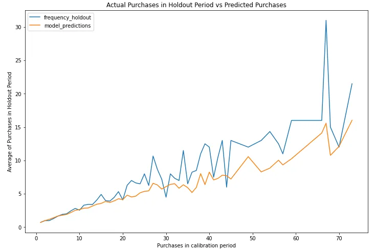

# Customer Churn Model (Non-Contractual)

## Introduction

### How many of your customers are still customers?

- In a [**contractual churn**](https://practicaldatascience.co.uk/machine-learning/how-to-create-a-contractual-churn-model) setting, like a mobile phone network or a broadband provider, you can tell how many of your customers are still customers (or “alive” as they’re called in the world of CLV), because you know how many open contracts you have.
  - Churn in the contractual context is a **binary classification** problem at a given point in time in these scenarios.
- In [**non-contractual churn**](https://practicaldatascience.co.uk/machine-learning/how-to-create-a-non-contractual-churn-model-for-your-ecommerce-site) settings, churn cannot be discretely defined here.
  - A customer who has made X number of purchases so far can either return for another purchase, or may never return.
  - Various approaches have been proposed to analyze the purchase behavior of customers by making distributional assumptions, including anomaly detection and Customer Lifetime Value (CLV) analysis

## Buy ’Til You Die Models

- **Buy ’Til You Die Models** (BTYD): from the “birth” of a customer (when she places her first order with our business) to the day she “dies” (when she turns to a competitor and thus is dead to us, the enterprise she’s spurned).
- BTYD is a class of statistical models to analyze customers’ behavioral and purchasing patterns in a non-subscription business model to model and predict a customer’s lifetime value (CLV or LTV).
- **Beta Geometric/Negative Binomial Distribution** (BG/NBD) Model and the **Gamma-Gamma** Model of Monetary Value to analyze the historical customer purchasing behavioral data and pattern and to predict the future frequency and monetary value of purchases.
  - These models have been empirically proven to be better than traditional approaches and follow the Buy Till You Die (BTYD) statistical models.
- The **BG/NBD** model predicts the future _expected number of transactions_ over a _pre-defined period_ together with the _probability of a customer being alive_.
- The **Gamma-Gamma** model will tie into the BG/NBD model to predict the _expected monetary value_ of the purchases in terms of current dollar value after discounting at a predetermined discount rate.

## Customer Lifetime Value (CLV)

- **Customer Lifetime Value** or CLV is the total `net income`, i.e: revenue minus costs, or `revenue`(depends on the data availablity) that a company can expect to earn from its customers over their entire relationship
  — Either at the individual customer level, cohort level, or over the entirety of its customer base
  — Discounted to today’s dollar value using the Discounted Cashflow (DCF) method.
- Usage: marketing and ecommerce
- CLV tells you the predicted value each customer will bring to your business over their lifetime, and as such requires the ability to detect which customers will churn as well as what they’re likely to spend if they’re retained.

## CLV Calculation

- Combination of models to calculate CLV:
  - Beta Geometric Negative Binomial Distribution (BG/NBD) model
  - Gamma-Gamma model
- These models are to predict the following:
  - Which customers are still customers
  - Who will order again in the next period
  - The number of orders each customer will place
  - The average order value of each customer’s order
  - The total amount each customer will generate for the business

### Data Preparation: RFM (Recency, Frequency, and Monetary Value) & T (Tenure)

- Both BG/NBD and Gamma-Gamma models require only the following data points at the customer level:
  - **Recency (R)** represents the age of a customer when they made their most recent purchase. This is equal to the duration between a customer’s first purchase and their latest purchase.
    - Note: If Ms. X made only _one purchase, her recency will be 0_.
  - **Frequency (F)** represents the number of periods in which a customer made repeat purchases.
    - This means that it is _one less than the total number of periods_ in which a customer made purchases.
    - If using days as units, then Frequency is the count of days (or whatever time period) the customer purchased after its first purchase.
    - Note 1: In case a customer made only one purchase, his Frequency will be 0.
    - Note 2: Frequency does not account for multiple purchases within the same time unit.
      - For example: If Mr. Y made two purchases on day 1 and three purchases on day 3, his frequency will still be 1 despite the multiple daily purchases.
  - **Tenure (T)** represents the age of a customer in whatever time units are chosen. This is equal to the duration between a customer’s first purchase and the end of the period under study.
  - **Monetary Value (M)** represents the average value of a given customer’s repeat purchases, i.e., the sum of all repeat purchases divided by the total number of time units on which repeat purchases were made.
    - Monetary value could be profit, or revenue, or any other amount as long as it is consistently calculated for each customer.
- **Lifetimes** package has the function to extract the above four required data points from the following transaction-level data: `summary_data_from_transaction_data()`.
  - Note 1: The `observation_period_end` date would usually represent the most recent order date within your dataframe.
  - Note 2: The first transaction by default is **not included** while calculating the frequency and monetary value.
    - To include it, just set the parameter `include_first_transaction` to True. To use the data with some fitters from the lifetimes package, this parameter must be set to False
  - Note 3: recency defintion in Lifetimes package is different from the recency definition below
    - For the `customer_id=12347`, `recency` is the number of days between her first (2010-12-07) and her latest transaction (2011-12-07), which is 365 days.
    - A bit counter-intuitively, it does not measure the days since her latest purchase.
- Example: Below is all the transactions of the single customer where `customer_id=12347`

  |       | customer_id | invoice_date | total_revenue |
  | ----: | ----------: | :----------- | ------------: |
  |   548 |       12347 | 2010-12-07   |        711.79 |
  |  2205 |       12347 | 2011-01-26   |        475.39 |
  |  4942 |       12347 | 2011-04-07   |        636.25 |
  |  7844 |       12347 | 2011-06-09   |        382.52 |
  | 10173 |       12347 | 2011-08-02   |        584.91 |
  | 15066 |       12347 | 2011-10-31   |       1294.32 |
  | 18367 |       12347 | 2011-12-07   |        224.82 |

- Calculate the RFMT values manually for a single customer

```Python
customer_birthday = customer_example['invoice_date'].min()      # 2010–12–05
customer_latest_trans = customer_example['invoice_date'].max()  # 2011–12–07
latest_date = df_orders['invoice_date'].max()                   # 2011–12–09: the end date of our analytical horizon

recency = customer_latest_trans - customer_birthday
longevity_T = latest_date - customer_birthday
frequency = customer_example.shape[0] - 1 # -1 as BG/NBD models focus on repeat purchases, it omits the initial transaction.
monetary_value = customer_example.loc[2205:,'total_revenue'].mean() # not include the first transaction @ index = 548
print(f"Recency: {recency.days}\nAge or Longevity (T): {longevity_T.days}\nFrequency: {frequency}\nMonetary Value: {monetary_value:.2f}")

# Recency: 365
# Age or Longevity (T): 367
# Frequency: 6
# Monetary Value: 599.70
```

- Calculate the RFMT values for all the customers at the transaction-level

```Python
df_rfmt = summary_data_from_transaction_data(df_orders,
                                             customer_id_col='customer_id',
                                             datetime_col='invoice_date',
                                             monetary_value_col='total_revenue',
                                             observation_period_end='2011-12-09 12:50:00',
                                            #  include_first_transaction=True
                                             )
df_rfmt.head(5) # print the summary for the first 5 customers
```

- As you can see, the `customer_id=12347` has the same result with calculating manually

  | customer_id | frequency | recency |   T | monetary_value |
  | ----------: | --------: | ------: | --: | -------------: |
  |       12346 |         0 |       0 | 325 |              0 |
  |       12347 |         6 |     365 | 367 |        599.702 |
  |       12348 |         3 |     283 | 358 |         301.48 |
  |       12349 |         0 |       0 |  18 |              0 |
  |       12350 |         0 |       0 | 310 |              0 |

- Plot the histogram of `'recency', 'frequency', 'T', 'monetary_value']`

```Python
fig, ((ax1, ax2), (ax3, ax4)) = plt.subplots(2,2, figsize=(15,8))
for idx, metric in enumerate(['recency', 'frequency', 'T', 'monetary_value']):
    sns.histplot(df_rfmt[metric], kde=True, ax=eval(f"ax{idx+1}"))
plt.show()
```

### BG/NBD model

- In non-contractual business settings, the purchase behavior of customers does not follow a deterministic trend.
  - Both **demand** levels and **churn rates** are random variables.
- A distributional model like BG/NBD describes the random processes that influence the customer behavior, individually and in aggregate.
- Beta Geometric Negative Binomial Distribution or BG/NBD model is based on the original Pareto/NBD model for CLV which was formulated by Schmittlein, Morrison, and Colombo in 1987.
- The method relies on four distributional assumptions to model the uncertainties:
  - Assumption 1: The **number of orders** a customer will place in a time period follows a **Poisson** distribution with transaction rate `lambda`.
    - This Poisson count distribution is equivalent to the assumption that the time between transactions follows an exponential distribution with the same transaction rate lambda.
  - Assumption 2:The **demand varies** independently between customers: heterogeneity in `lambda`.
    - The variation in lambda is a random variable that follows a **Gamma** distribution with shape parameter `r` and scale `alpha`.
  - Assumption 3:After any purchase, a customer may become inactive with probability `p` and turns away from the business.
    - The churn risk follows a **Geometric** distribution.
  - Assumption 4:The **churn risk varies** independently between customers: heterogeneity in `p`.
    - The variation of the churn or dropout probability `p` is a random variable that follows a **Beta** distribution.
- The assumption 1 & 2 combine to form a Poisson-Gamma mixture distribution. If the lambda rate is a Gamma random variable, then the mixture distribution is equal to a Negative binomial distribution — Wikipedia.

```Python
# BG/NBD model
bgf = BetaGeoFitter(penalizer_coef=1e-06)
bgf.fit(
        frequency = df_rfmt["frequency"],
        recency = df_rfmt["recency"],
        T = df_rfmt["T"],
        weights = None,
        verbose = True,
        tol = 1e-06
)
```

#### Number of Order Prediction (up to time t)

- Use the BG/NBD model data to predict the number of purchases each customer will make in some forthcoming periods.

```Python
# predict for single customer
# predict purchases for a selected customer for t days
t = 30
cust_id = 12748

df_rfmt_C = df_rfmt.loc[cust_id,:]
pred_C = bgf.predict(t,
                    df_rfmt_C["frequency"],
                    df_rfmt_C["recency"],
                    df_rfmt_C["T"])
print(f"customer_id={cust_id}: expected number of purchases within {t} days = {pred_C:.1f}")

# customer_id=12748: expected number of purchases within 30 days = 7.7
```

- Predict for all the customer in the dataset

```Python
def predict_purch(df, t):
    # predict each customer's purchases over next t days
    df[f"predict_purch_{t}" ] = \
            bgf.predict(
                t,
                df["frequency"],
                df["recency"],
                df["T"])
    return df
# get the expected purchase volume over 10, 30, 60, and 90 days.
for t in [10,30,60,90]:
    df_rfmt = predict_purch(df_rfmt, t)
```

- Plot the distribution regarding the number of purchases over the next 90 days

```Python
sns.histplot(df_rfmt['predict_purch_90'], kde=True, bins=50).set_xlim(0,8);
```

<p align="center"></p>

#### Customer Churn Probability Prediction

```Python
# probability that a customer is alive for each customer in dataframe
prob_alive = bgf.conditional_probability_alive(
        frequency = df_rfmt["frequency"],
        recency = df_rfmt["recency"],
        T = df_rfmt["T"])

df_rfmt["prob_alive"] = prob_alive
```

- Let’s examine customer ID = 15107, with a prob_alive of 75% by looking at all his or her transactions & make use of `plot_history_alive` in `lifetimes` package's plotting

```Python
customer_id = 15107
# filter only the transactions of customer_id = 15107
df_c_15107 = df_orders[df_orders["customer_id"]==15107]

from lifetimes.plotting import plot_history_alive

# history of the selected customer: probability over time of being alive
fig = plt.figure(figsize=(20,4))
span_days = 373
plot_history_alive(
                    model = bgf,
                    t=span_days,
                    transactions = df_c_15107,
                    datetime_col = "invoice_date");
```

<p align="center"></p>

- Customer 12347 from our original dataset, we can see that they’ve placed 6 orders since they were first acquired on 2010-12-07 about 365 days ago.
- The alive probability is decreasing over the time, starting from 1.0 to 0.75

#### Model Visualization

##### Frequency/Recency Heatmap

- `plot_frequency_recency_matrix()` is to create predictions and visualise once the BG/NBD model has been fitted to the data.
- The matrix has
  - The customer’s **recency** on the Y axis
  - The **frequency** on the X axis
  - The heatmap component is showing the predicted number of future purchases customers at intersecting points will make in one unit of time.
- The customers most likely to order are those who’ve placed lots of previous orders and have been seen relatively recently.

```Python
def plot_freq_rec(t):
    plt.figure(figsize=(6, 6))
    plot_frequency_recency_matrix(
            model = bgf,
            T = t,
);


# call plotter function for different forecast periods:
t_list = [10, 90]
_ = [plot_freq_rec(t) for t in t_list]
```

<p align="center"></p>

- The frequency/recency matrices both show:
  - With a reddish hot zone in the lower right corner. The shape of the distribution remains constant.
  - They only differ in their scales on the right-hand side: the number of purchases over a longer or shorter number of days.
- Each matrix demonstrates that a customer with a high frequency (80 or more transactions ), combined with a long recency (more than 300 days between first and latest transactions), will exhibit the highest propensity for future purchases: orange to red, implying 15 to 25 transactions over the next 90 days.

##### Probability of n_purchases up to time

- `probability_of_n_purchases_up_to_time` computes the average number of transactions per customer within a period of time.

```Python
def prob_purch(t, n):
    # probability of n repeat purchases within t days
    p = bgf.probability_of_n_purchases_up_to_time(t, n)
    return p


  # call helper function: probability of n repeat purchases within t days
t = 90                  # forecast period, days
purch = range(0,10)   # number of repeat purchases from 0 to 9
probs = [prob_purch(t,n) for n in purch]

fig, ax = plt.subplots(figsize=(8,4))
ax.plot(purch, probs, '-o', color='blue')
ax.set(xlabel="Avg number of purchases", ylabel="Probability")
ax.set_xticks(purch)
plt.show()
```

<p align="center"></p>

#### Model Validation

- To perform model cross-validation, we can partition our transactional data into calibration and a holdout dataset.
- Lifetimes uses the terms **calibration** and **holdout** periods for what we would label the training and test datasets in most other applications.
- `calibration_and_holdout_data()` takes as its arguments the chosen end of the calibration period and the end of the observation period.

##### How to choose hold out period ?

- This particular dataset comprises 400,000 records, but they are spread over 4,000 customers and cover just two years.
- Many smaller customers submit their repeat orders a couple of months apart.
- If we set the holdout period to a small number of time periods, it will contain only a few repeat transactions for small customers. We risk that it does not fully reflect their demand patterns.
- In this dataset, a holdout period shorter than 100 days does not work well in this case.
  - Ideally it should be close to 200 days.
- Yet if we reserve too many days for the holdout period, the same problem can afflict the training phase: a training period as short as 365 days may not catch enough customer-specific transactions to pin down their demand patterns.
- Alternative: It would be preferable to create the holdout dataset by **randomly drawing customers from the entire dataset** and then check whether the purchase behavior of the customers in the training dataset differs from the behavior of the holdout customers.
  - But many of Lifetimes’ evaluation functions take a time period t as their parameter and would not work if calibration and holdout transactions overlap in the same period of time, even if the customers are kept separate.

```Python
# train/test split (calibration/holdout)
t_holdout = 240                                         # days to reserve for holdout period

max_date = df_orders["invoice_date"].max()              # end date of observations


max_cal_date = max_date - timedelta(days=t_holdout)     # end date of chosen calibration period
print(f"End of calibration period: {max_cal_date}")
print(f"End of observations      : {max_date}")

# End of calibration period: 2011-04-13
# End of observations      : 2011-12-09
```

- Generate the calibratiion & holdout set

```Python
summary_cal_holdout = calibration_and_holdout_data(transactions=df_orders,
                                                   customer_id_col='customer_id',
                                                   datetime_col='invoice_date',
                                                   monetary_value_col='total_revenue',
                                                   calibration_period_end=max_cal_date,  # 2011-04-13
                                                   observation_period_end=max_date,      # 2011-12-09
                                                   freq = "D"
                                                   )

```

- Fit a new BG/NBD model on calibration data, and compare the predicted and actual number of repeat purchases over the holdout period.

```Python
# Retain only the +ve frequency_cal values
summary_cal_holdout = summary_cal_holdout[summary_cal_holdout['frequency_cal'] > 0]

# train BG/NBD model on the calibration data
bgf_cal = BetaGeoFitter()
bgf_cal.fit(summary_cal_holdout['frequency_cal'],
            summary_cal_holdout['recency_cal'],
            summary_cal_holdout['T_cal'])

# plot actual vs predicted frequency during the holdout period
plot_calibration_purchases_vs_holdout_purchases(
	bgf_cal, summary_cal_holdout, n = int(summary_cal_holdout['frequency_holdout'].max()),
	figsize = (12,8));
# n represents the max frequency values to be plotted on the x-axis
```

- `plot_calibration_purchases_vs_holdout_purchases` from `lifetimes`'s plotting is to compare the averages of the actual and predicted number of repeat purchases over the holdout period

<p align="center"></p>

- In the plot above:
  - the x-axis represents the frequency values observed in the calibration period
  - the y-axis represents the average frequency in the holdout period (blue line) and the average frequency predicted by the model (orange line)
- As we can see, up to around 15th repeat purchases, the model can very accurately predict the customer base’s behavior. For higher frequency values, the model does produce a lot more error and under-estimates the average repeat purchases. As indicated earlier, this is most likely caused by a relatively low number of customers in our data with a large number of repeat purchases.

### Gamma-Gamma Model

- The **BG/NBD** model enables us to predict both the number of transactions and the churn risk (conversely, the probability of being alive) for each customer.
- **Gamma-Gamma** (GG) model was written by Peter Fader and Bruce Hardie in 2013 and was based on one of Fader’s earlier models to estimate the **monetary values** that correspond to the count data.
  - Fader/Hardie suggested the **Gamma distribution** as a more appropriate alternative to mirror a customer’s average transaction value.
- Assumption: monetary value and frequency are independent variables and aren’t correlated with each other.
- Goal: to predict the monetary value of the orders the customer will place
- For the below example, since the dataset is pretty small, so we will use the entire datasets to train the model `df_rfmt` instead of the `summary_cal_holdout` (calibration & holdout set)

```Python
# The GG model only works for positive monetary values (>0).
# Thus, we exclude the few transactions with a unit price of zero.
returning_customers = df_rfmt[(df_rfmt['frequency'] > 0) & (df_rfmt['monetary_value'] > 0)]

# get the correlation between 'monetary_value' & 'frequency'
returning_customers[['monetary_value', 'frequency']].corr()
```

- The correlation matrix confirms that the Pearson’s correlation coefficient amounts to a modest 0.015882 in our example, low enough that we will proceed.

  |                | monetary_value | frequency |
  | :------------- | -------------: | --------: |
  | monetary_value |              1 |  0.015882 |
  | frequency      |       0.015882 |         1 |

```Python
from lifetimes import GammaGammaFitter

ggf = GammaGammaFitter(penalizer_coef = 1e-06)
ggf.fit(returning_customers['frequency'],
        returning_customers['monetary_value'],
        weights = None,
        # verbose = True,
        tol = 1e-06,
        q_constraint = True
)
# ggf.summary
```

#### Average Order Value (AOV)

- Lifetimes’ function `conditional_expected_average_profit` to compute every customer’s expected monetary value.
  - Our source dataset does not offer profit margins, therefore the function, despite its name, returns the expected average revenues or average order value (aov)

```Python
# predicted average order value (aov) for each customer.
predicted_monetary = ggf.conditional_expected_average_profit(
        returning_customers['frequency'],
        returning_customers['monetary_value']
)
aov_df = pd.DataFrame(predicted_monetary, columns = ['aov'])
aov_df = aov_df.sort_values(by='aov', ascending=False)

# plot the distribution of aov
ax = sns.histplot(aov_df['aov'], kde=True).set_xlim(0, 2500);
```

### Customer Lifetime Value

- A **customer’s “lifetime”** denotes the time from her first transaction to her unknown future churn date, when she will turn away from our business.
  - For practical purposes, the “lifetime” horizon should be limited to a user-defined time period, for instance the next 12 months
- BG/NBD model to predict the number of orders
- Gamma-Gamma model to predict their values using the Gamma-Gamma model’s `customer_lifetime_value()` function which requires
  - `bgf` model
  - `recency`, `frequency`, `monetary_value`, and `T` data for each customers.
  - The `time` parameter is in **months** and defines how many months into the future we wish to predict.
  - `discount_rate` relates to discounted cash flow (DCF), which is a financial measure for adjusting the cost of capital. This is a monthly adjusted discount rate and uses a default value of 0.01 in this package.
- The customer lifetime value is the outcome of a discounted cash flow (DCF) calculation.
  - The time-value-of-money concept:
    - A sum of money is worth more in the near future than in the far future.
    - A customer whose proceeds flow to the business now is more valuable than a customer who will contribute revenues in the more remote future.
    - The time value of money is expressed by the **discount rate**.
- The discount should reflect our company’s cost of capital: a weighted average of
  - the **interest rate** the company owes on its loans and
  - The **return on equity** (dividend rate) the company’s shareholders expect to receive.

```Python
# The GG model only works for positive monetary values (>0).
# Thus, we exclude the few transactions with a unit price of zero.
returning_customers = df_rfmt[(df_rfmt['frequency'] > 0) & (df_rfmt['monetary_value'] > 0)]
# re-fit the BetaGeoFitter BG/NBD model to our dataset for the returning customers
bgf.fit(returning_customers['frequency'],
        returning_customers['recency'],
        returning_customers['T'])
```

- Note: Lifetimes actually expects a **monthly adjusted discount** rate. Line 5 translates the annual rate to a monthly rate.
- In this example, I set a low annual discount rate of 6% in line 2.

```Python
# compute customer lifetime value
DISCOUNT_a = 0.06                # annual discount rate
LIFE = 12                        # lifetime expected for the customers in months

discount_m = (1 + DISCOUNT_a)**(1/12) - 1     # monthly discount rate
# predicts your best customers to be over the next 12 months.
preds = ggf.customer_lifetime_value(
    bgf,
    returning_customers['frequency'],
    returning_customers['recency'],
    returning_customers['T'],
    returning_customers['monetary_value'],
    time = LIFE,
    discount_rate = discount_m
)

preds = preds.to_frame().reset_index()

preds.sort_values(by='clv', ascending=False).head(5)
```

|      | customer_id |    clv |
| ---: | ----------: | -----: |
| 1938 |       16446 | 386475 |
| 1111 |       14646 | 218183 |
| 2706 |       18102 | 181695 |
| 2413 |       17450 | 149310 |
|  834 |       14096 | 118386 |

- Top 5 customers, with lifetime values above £ 100,000 — obviously wholesalers; or extremely dedicated private consumers with a concerning addiction to souvenirs and gifts.
- The mean CLV across all customers amounts to £ 2,847.

## Customer Segmentation

- There are multiple attributes (such as RFM, CLV, AOV) that can used to perform the customer segmentation
- In this example, we will use the AOV to group the customer into different tiers

### Method 1: Quantile-based Discretization or Binning

- Bin 1 contains the lowest CLV customers who have an average value of £167.85, the averages go up in each bin,
- Bin 5 has the highest CLV customers with an average value of £1186.16.
  - However, there’s quite a spread at Bin 5, where it includes customers from £502.21 to £125,940.17
- This is a long-tail distribution &#8594; K-mean clustering

```Python
aov_df['aov_bin'] = pd.qcut(aov_df['aov'], q=5, labels=[1, 2, 3, 4, 5])
aov_df = aov_df.reset_index()
```

| aov_bin | count | min_aov | max_aov | std_aov | mean_aov |
| ------: | ----: | ------: | ------: | ------: | -------: |
|       1 |   558 | 35.3249 | 208.941 | 31.9082 |  167.853 |
|       2 |   558 | 209.021 | 283.576 | 20.3529 |  243.836 |
|       3 |   558 | 283.845 | 368.285 | 23.0777 |  326.862 |
|       4 |   558 | 368.407 | 502.075 | 38.4466 |  425.239 |
|       5 |   558 | 502.212 |  125940 | 5392.07 |  1186.16 |

### Method 2: K-means Clustering

#### Example 1: Customer Segmentation based on AOV

- Note: cluster numbers aren’t sorted in order, you can clearly see the differences in AOV across the five clusters.

```Python
aov_clusters = aov_df[['aov']]
kmeans = KMeans(n_clusters=5)
kmeans.fit(aov_clusters)

aov_clusters = aov_clusters.assign(cluster=kmeans.labels_)
unsorted_aov = aov_clusters.groupby('cluster')['aov'].mean().sort_values(ascending=True).to_frame().reset_index()
```

|     | cluster |     aov |
| --: | ------: | ------: |
|   0 |       0 | 299.376 |
|   1 |       3 |  788.86 |
|   2 |       4 | 2331.88 |
|   3 |       2 | 8847.96 |
|   4 |       1 |  125940 |

- Cluster 3 contains lowest spenders, averaging ~£297.594 per order, while clusters 2 and 1 include some very big spenders.

```Python
# create the new mapping
cluster_mapping = dict(zip(unsorted_aov['cluster'].values, unsorted_aov.index+1))

# to create the new col 'sorted_cluster' to map the cluster based on the order of increasing aov
aov_clusters['sorted_cluster'] = aov_clusters['cluster'].map(cluster_mapping)
```

#### Example 2: Customer Segmentation based on RFM features

- We will apply the K-mean clustering for each R, F, M feature into 5 clusters (or scoring 1 to 5)

- The individual R, F, and M scores are then aggregated to form an overall RFM score, such as 111 or 555. Since 5 x 5 x 5 = 125, this gives a total of 125 different RFM score permutations, such as 111, 153, and 555, each of which describes a segment of customers.
- The RFM model is based on the assumption that customers who have been purchased more recently, have placed more orders, and that customers who spend more money with the business are likely to be more valuable and are more likely to shop again than those that have not.

| RFM Score | Description                                                                                                                                                                                                                                                             |
| --------- | ----------------------------------------------------------------------------------------------------------------------------------------------------------------------------------------------------------------------------------------------------------------------- |
| 111       | Low value customer: A customer who is the least recent, has placed the least number of orders, and has spent the lowest amount. You may want to try and reactivate these, or market to them less frequently.                                                            |
| 511       | New customers: A customer who is the most recent, but has placed the least number of orders, and has spent the lowest amount. To prevent them being one-time customers, these can be targeted to get them to return.                                                    |
| 155       | High value lapsed customer: A customer who is not recent but who has placed a high number of orders and spent a high amount. It would be worthwhile trying to win these repeat customers back.                                                                          |
| 555       | High value customer: A customer who is the most recent, has placed the highest number of orders, and has spent the greatest amount. These big spenders are very valuable and represent your best customers, so will benefit from preferential treatment to retain them. |

```Python
from collections import defaultdict
from typing import List
class RfmCluster:
    def __init__(self, metrics: List[str], log: bool = True):
        self.metrics = metrics
        self.log = log
        self.n_clusters = 5
        self.km_dicts = defaultdict(dict)


    def fit(self, df):
        for metric in self.metrics:
            km_model, km_map = self._fit(df, metric)
            self.km_dicts[metric] = {
                "model": km_model,
                "mapping": km_map
            }
    def transform(self, df):
        df_tmp = df.copy()
        for metric in self.km_dicts:
            km_model, km_map = self.km_dicts[metric].values()

            cluster_name = metric[0].upper()
            samples = np.log1p(df_tmp[[metric]]) if self.log else df_tmp[[metric]]
            df_tmp[cluster_name] = km_model.predict(samples)
            df_tmp[cluster_name] = df_tmp[cluster_name].map(km_map)
        return df_tmp

    def _fit(self, df, metric, ascending=True):

        if self.log:
            # in case, you want to take log the feature
            df = df.copy()

            df[metric] = np.log1p(df[metric])

        df_m = df[[metric]]
        km_model = KMeans(n_clusters = self.n_clusters, init = 'k-means++', n_init='auto')
        km_model.fit(df_m)

        # create a new column 'unsorted_cluster' with the prediction from kmean model
        df_m = df_m.assign(unsorted_cluster=km_model.predict(df_m))
        # sort the cluster based on the mean of metric
        df_sorted = df_m.groupby('unsorted_cluster')[metric].mean().round(3) \
                      .sort_values(ascending=ascending).to_frame().reset_index()
        # create the new mapping
        km_map = dict(zip(df_sorted['unsorted_cluster'].values, df_sorted.index+1))
        return km_model, km_map

rfm_cluster = RfmCluster(metrics=['recency', 'frequency', 'monetary_value'])
rfm_cluster.fit(rfm_df)
clustered_rfm_df = rfm_cluster.transform(rfm_df)
```

##### RFM Segment Naming

- A recent PhD thesis on RFM by Umit Uysal (2019) split customers up as Stars, Loyal, Potential loyal, Hold and improve, and Risky.

| Customer Segment | RFM Scores |
| ---------------- | ---------- |
| Star             | 542-555    |
|                  | 455        |
| Loyal            | 541        |
|                  | 511-535    |
|                  | 345-454    |
| Potential loyal  | 311-353    |
| Hold and improve | 211-255    |
| Risky            | 111-155    |

```Python
def label_rfm_segments(rfm):
    if (rfm >= 111) & (rfm <= 155):
        return 'Risky'

    elif (rfm >= 211) & (rfm <= 255):
        return 'Hold and improve'

    elif (rfm >= 311) & (rfm <= 353):
        return 'Potential loyal'

    elif ((rfm >= 354) & (rfm <= 454)) or ((rfm >= 511) & (rfm <= 535)) or (rfm == 541):
        return 'Loyal'

    elif (rfm == 455) or (rfm >= 542) & (rfm <= 555):
        return 'Star'

    else:
        return 'Other'

clustered_rfm_df['RFM'] = clustered_rfm_df['R'].astype(str) + clustered_rfm_df['F'].astype(str) + clustered_rfm_df['M'].astype(str)
clustered_rfm_df['RFM'] = clustered_rfm_df['RFM'].astype(int)

# assign a cluster name for each R+F+M cluster combination
clustered_rfm_df['rfm_segment_name'] = clustered_rfm_df['RFM'].apply(lambda x: label_rfm_segments(x))

# visualisation the rfm_segment_name
# !pip3 install squarify
import squarify

fig, ax = plt.subplots(1, figsize = (10,10))

squarify.plot(sizes=df_treemap['customers'],
              label=df_treemap['rfm_segment_name'],
              alpha=.8,
              color=['tab:red', 'tab:purple', 'tab:brown', 'tab:pink', 'tab:gray']
             )
plt.axis('off')
plt.show()
```

## Reference

- [How to calculate CLV using BG/NBD and Gamma-Gamma](https://practicaldatascience.co.uk/data-science/how-to-calculate-clv-using-bgnbd-and-gamma-gamma)
