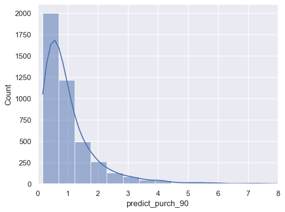
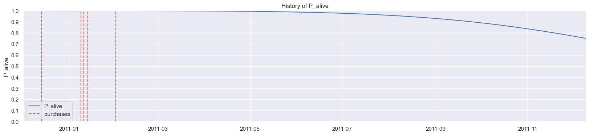
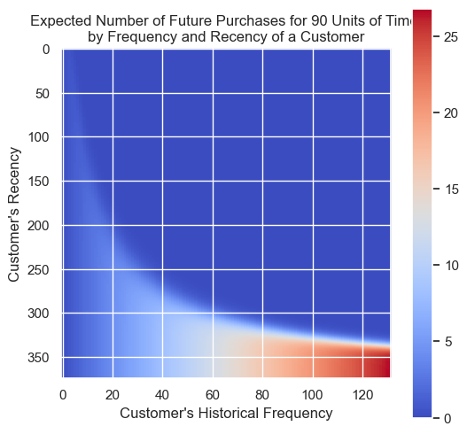
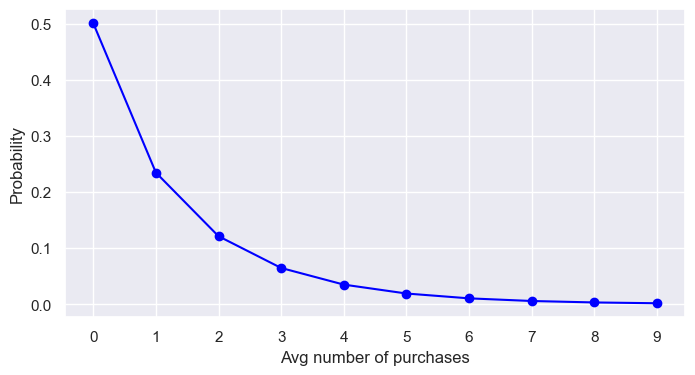

# Customer Churn Model - Non-Contractual

## Introduction

### How many of your customers are still customers?

- In a [**contractual churn**](https://practicaldatascience.co.uk/machine-learning/how-to-create-a-contractual-churn-model) setting, like a mobile phone network or a broadband provider, you can tell how many of your customers are still customers (or “alive” as they’re called in the world of CLV), because you know how many open contracts you have.
  - Churn in the contractual context is a **binary classification** problem at a given point in time in these scenarios.
- In [**non-contractual churn**](https://practicaldatascience.co.uk/machine-learning/how-to-create-a-non-contractual-churn-model-for-your-ecommerce-site) settings, churn cannot be discretely defined here.
  - A customer who has made X number of purchases so far can either return for another purchase, or may never return.
  - Various approaches have been proposed to analyze the purchase behavior of customers by making distributional assumptions, including anomaly detection and Customer Lifetime Value (CLV) analysis

## Buy ’Til You Die Models

- **Buy ’Til You Die Models** (BTYD): from the “birth” of a customer (when she places her first order with our business) to the day she “dies” (when she turns to a competitor and thus is dead to us, the enterprise she’s spurned).
- BTYD is a class of statistical models to analyze customers’ behavioral and purchasing patterns in a non-subscription business model to model and predict a customer’s lifetime value (CLV or LTV).
- **Beta Geometric/Negative Binomial Distribution** (BG/NBD) Model and the **Gamma-Gamma** Model of Monetary Value to analyze the historical customer purchasing behavioral data and pattern and to predict the future frequency and monetary value of purchases.
  - These models have been empirically proven to be better than traditional approaches and follow the Buy Till You Die (BTYD) statistical models.
- The **BG/NBD** model predicts the future _expected number of transactions_ over a _pre-defined period_ together with the _probability of a customer being alive_.
- The **Gamma-Gamma** model will tie into the BG/NBD model to predict the _expected monetary value_ of the purchases in terms of current dollar value after discounting at a predetermined discount rate.

## Customer Lifetime Value (CLV)

- **Customer Lifetime Value** or CLV is the total `net income`, i.e: revenue minus costs, or `revenue`(depends on the data availablity) that a company can expect to earn from its customers over their entire relationship
  — Either at the individual customer level, cohort level, or over the entirety of its customer base
  — Discounted to today’s dollar value using the Discounted Cashflow (DCF) method.
- Usage: marketing and ecommerce
- CLV tells you the predicted value each customer will bring to your business over their lifetime, and as such requires the ability to detect which customers will churn as well as what they’re likely to spend if they’re retained.

## CLV Calculation

- Combination of models to calculate CLV:
  - Beta Geometric Negative Binomial Distribution (BG/NBD) model
  - Gamma-Gamma model
- These models are to predict the following:
  - Which customers are still customers
  - Who will order again in the next period
  - The number of orders each customer will place
  - The average order value of each customer’s order
  - The total amount each customer will generate for the business

### Data Preparation: RFM (Recency, Frequency, and Monetary Value) & T (Tenure)

- Both BG/NBD and Gamma-Gamma models require only the following data points at the customer level:
  - **Recency (R)** represents the age of a customer when they made their most recent purchase. This is equal to the duration between a customer’s first purchase and their latest purchase.
    - Note: If Ms. X made only _one purchase, her recency will be 0_.
  - **Frequency (F)** represents the number of periods in which a customer made repeat purchases.
    - This means that it is _one less than the total number of periods_ in which a customer made purchases.
    - If using days as units, then Frequency is the count of days (or whatever time period) the customer purchased after its first purchase.
    - Note 1: In case a customer made only one purchase, his Frequency will be 0.
    - Note 2: Frequency does not account for multiple purchases within the same time unit.
      - For example: If Mr. Y made two purchases on day 1 and three purchases on day 3, his frequency will still be 1 despite the multiple daily purchases.
  - **Tenure (T)** represents the age of a customer in whatever time units are chosen. This is equal to the duration between a customer’s first purchase and the end of the period under study.
  - **Monetary Value (M)** represents the average value of a given customer’s repeat purchases, i.e., the sum of all repeat purchases divided by the total number of time units on which repeat purchases were made.
    - Monetary value could be profit, or revenue, or any other amount as long as it is consistently calculated for each customer.
- **Lifetimes** package has the function to extract the above four required data points from the following transaction-level data: `summary_data_from_transaction_data()`.
  - Note 1: The `observation_period_end` date would usually represent the most recent order date within your dataframe.
  - Note 2: The first transaction by default is **not included** while calculating the frequency and monetary value.
    - To include it, just set the parameter `include_first_transaction` to True. To use the data with some fitters from the lifetimes package, this parameter must be set to False
  - Note 3: recency defintion in Lifetimes package is different from the recency definition below
    - For the `customer_id=12347`, `recency` is the number of days between her first (2010-12-07) and her latest transaction (2011-12-07), which is 365 days.
    - A bit counter-intuitively, it does not measure the days since her latest purchase.
- Example: Below is all the transactions of the single customer where `customer_id=12347`
  | | customer_id | invoice_date | total_revenue |
  |------:|--------------:|:---------------|----------------:|
  | 548 | 12347 | 2010-12-07 | 711.79 |
  | 2205 | 12347 | 2011-01-26 | 475.39 |
  | 4942 | 12347 | 2011-04-07 | 636.25 |
  | 7844 | 12347 | 2011-06-09 | 382.52 |
  | 10173 | 12347 | 2011-08-02 | 584.91 |
  | 15066 | 12347 | 2011-10-31 | 1294.32 |
  | 18367 | 12347 | 2011-12-07 | 224.82 |

- Calculate the RFMT values manually for a single customer

```Python
customer_birthday = customer_example['invoice_date'].min()      # 2010–12–05
customer_latest_trans = customer_example['invoice_date'].max()  # 2011–12–07
latest_date = df_orders['invoice_date'].max()                   # 2011–12–09: the end date of our analytical horizon

recency = customer_latest_trans - customer_birthday
longevity_T = latest_date - customer_birthday
frequency = customer_example.shape[0] - 1 # -1 as BG/NBD models focus on repeat purchases, it omits the initial transaction.
monetary_value = customer_example.loc[2205:,'total_revenue'].mean() # not include the first transaction @ index = 548
print(f"Recency: {recency.days}\nAge or Longevity (T): {longevity_T.days}\nFrequency: {frequency}\nMonetary Value: {monetary_value:.2f}")

# Recency: 365
# Age or Longevity (T): 367
# Frequency: 6
# Monetary Value: 599.70
```

- Calculate the RFMT values for all the customers at the transaction-level

```Python
df_rfmt = summary_data_from_transaction_data(df_orders,
                                             customer_id_col='customer_id',
                                             datetime_col='invoice_date',
                                             monetary_value_col='total_revenue',
                                             observation_period_end='2011-12-09 12:50:00',
                                            #  include_first_transaction=True
                                             )
df_rfmt.head(5) # print the summary for the first 5 customers
```

- As you can see, the `customer_id=12347` has the same result with calculating manually

  | customer_id | frequency | recency |   T | monetary_value |
  | ----------: | --------: | ------: | --: | -------------: |
  |       12346 |         0 |       0 | 325 |              0 |
  |       12347 |         6 |     365 | 367 |        599.702 |
  |       12348 |         3 |     283 | 358 |         301.48 |
  |       12349 |         0 |       0 |  18 |              0 |
  |       12350 |         0 |       0 | 310 |              0 |

- Plot the histogram of `'recency', 'frequency', 'T', 'monetary_value']`

```Python
fig, ((ax1, ax2), (ax3, ax4)) = plt.subplots(2,2, figsize=(15,8))
for idx, metric in enumerate(['recency', 'frequency', 'T', 'monetary_value']):
    sns.histplot(df_rfmt[metric], kde=True, ax=eval(f"ax{idx+1}"))
plt.show()
```

### BG/NBD model

- In non-contractual business settings, the purchase behavior of customers does not follow a deterministic trend.
  - Both **demand** levels and **churn rates** are random variables.
- A distributional model like BG/NBD describes the random processes that influence the customer behavior, individually and in aggregate.
- Beta Geometric Negative Binomial Distribution or BG/NBD model is based on the original Pareto/NBD model for CLV which was formulated by Schmittlein, Morrison, and Colombo in 1987.
- The method relies on four distributional assumptions to model the uncertainties:
  - Assumption 1: The **number of orders** a customer will place in a time period follows a **Poisson** distribution with transaction rate `lambda`.
    - This Poisson count distribution is equivalent to the assumption that the time between transactions follows an exponential distribution with the same transaction rate lambda.
  - Assumption 2:The **demand varies** independently between customers: heterogeneity in `lambda`.
    - The variation in lambda is a random variable that follows a **Gamma** distribution with shape parameter `r` and scale `alpha`.
  - Assumption 3:After any purchase, a customer may become inactive with probability `p` and turns away from the business.
    - The churn risk follows a **Geometric** distribution.
  - Assumption 4:The **churn risk varies** independently between customers: heterogeneity in `p`.
    - The variation of the churn or dropout probability `p` is a random variable that follows a **Beta** distribution.
- The assumption 1 & 2 combine to form a Poisson-Gamma mixture distribution. If the lambda rate is a Gamma random variable, then the mixture distribution is equal to a Negative binomial distribution — Wikipedia.

```Python
# BG/NBD model
bgf = BetaGeoFitter(penalizer_coef=1e-06)
bgf.fit(
        frequency = df_rfmt["frequency"],
        recency = df_rfmt["recency"],
        T = df_rfmt["T"],
        weights = None,
        verbose = True,
        tol = 1e-06
)
```

#### Number of Order Prediction (up to time t)

- Use the BG/NBD model data to predict the number of purchases each customer will make in some forthcoming periods.

```Python
# predict for single customer
# predict purchases for a selected customer for t days
t = 30
cust_id = 12748

df_rfmt_C = df_rfmt.loc[cust_id,:]
pred_C = bgf.predict(t,
                    df_rfmt_C["frequency"],
                    df_rfmt_C["recency"],
                    df_rfmt_C["T"])
print(f"customer_id={cust_id}: expected number of purchases within {t} days = {pred_C:.1f}")

# customer_id=12748: expected number of purchases within 30 days = 7.7
```

- Predict for all the customer in the dataset

```Python
def predict_purch(df, t):
    # predict each customer's purchases over next t days
    df[f"predict_purch_{t}" ] = \
            bgf.predict(
                t,
                df["frequency"],
                df["recency"],
                df["T"])
    return df
# get the expected purchase volume over 10, 30, 60, and 90 days.
for t in [10,30,60,90]:
    df_rfmt = predict_purch(df_rfmt, t)
```

- Plot the distribution regarding the number of purchases over the next 90 days

```Python
sns.histplot(df_rfmt['predict_purch_90'], kde=True, bins=50).set_xlim(0,8);
```

<p align="center"></p>

#### Customer Churn Probability Prediction

```Python
# probability that a customer is alive for each customer in dataframe
prob_alive = bgf.conditional_probability_alive(
        frequency = df_rfmt["frequency"],
        recency = df_rfmt["recency"],
        T = df_rfmt["T"])

df_rfmt["prob_alive"] = prob_alive
```

- Let’s examine customer ID = 15107, with a prob_alive of 75% by looking at all his or her transactions & make use of `plot_history_alive` in `lifetimes` package's plotting

```Python
customer_id = 15107
# filter only the transactions of customer_id = 15107
df_c_15107 = df_orders[df_orders["customer_id"]==15107]

from lifetimes.plotting import plot_history_alive

# history of the selected customer: probability over time of being alive
fig = plt.figure(figsize=(20,4))
span_days = 373
plot_history_alive(
                    model = bgf,
                    t=span_days,
                    transactions = df_c_15107,
                    datetime_col = "invoice_date");
```

<p align="center"></p>

- Customer 12347 from our original dataset, we can see that they’ve placed 6 orders since they were first acquired on 2010-12-07 about 365 days ago.
- The alive probability is decreasing over the time, starting from 1.0 to 0.75

#### Model Visualization

##### Frequency/Recency Heatmap

- `plot_frequency_recency_matrix()` is to create predictions and visualise once the BG/NBD model has been fitted to the data.
- The matrix has
  - The customer’s **recency** on the Y axis
  - The **frequency** on the X axis
  - The heatmap component is showing the predicted number of future purchases customers at intersecting points will make in one unit of time.
- The customers most likely to order are those who’ve placed lots of previous orders and have been seen relatively recently.

```Python
def plot_freq_rec(t):
    plt.figure(figsize=(6, 6))
    plot_frequency_recency_matrix(
            model = bgf,
            T = t,
);


# call plotter function for different forecast periods:
t_list = [10, 90]
_ = [plot_freq_rec(t) for t in t_list]
```

<p align="center"></p>

- The frequency/recency matrices both show:
  - With a reddish hot zone in the lower right corner. The shape of the distribution remains constant.
  - They only differ in their scales on the right-hand side: the number of purchases over a longer or shorter number of days.
- Each matrix demonstrates that a customer with a high frequency (80 or more transactions ), combined with a long recency (more than 300 days between first and latest transactions), will exhibit the highest propensity for future purchases: orange to red, implying 15 to 25 transactions over the next 90 days.

##### Probability of n_purchases up to time

- `probability_of_n_purchases_up_to_time` computes the average number of transactions per customer within a period of time.

```Python
def prob_purch(t, n):
    # probability of n repeat purchases within t days
    p = bgf.probability_of_n_purchases_up_to_time(t, n)
    return p


  # call helper function: probability of n repeat purchases within t days
t = 90                  # forecast period, days
purch = range(0,10)   # number of repeat purchases from 0 to 9
probs = [prob_purch(t,n) for n in purch]

fig, ax = plt.subplots(figsize=(8,4))
ax.plot(purch, probs, '-o', color='blue')
ax.set(xlabel="Avg number of purchases", ylabel="Probability")
ax.set_xticks(purch)
plt.show()
```

<p align="center"></p>

## Reference

- [How to calculate CLV using BG/NBD and Gamma-Gamma](https://practicaldatascience.co.uk/data-science/how-to-calculate-clv-using-bgnbd-and-gamma-gamma)
