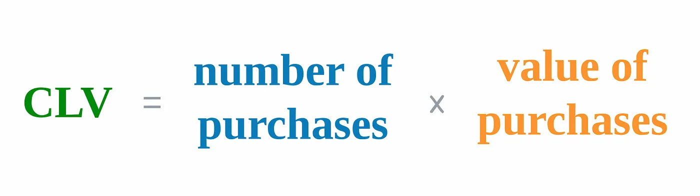
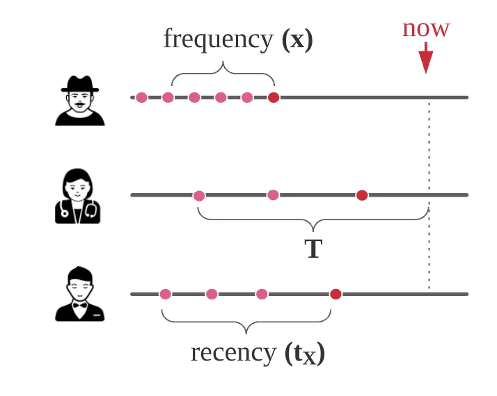
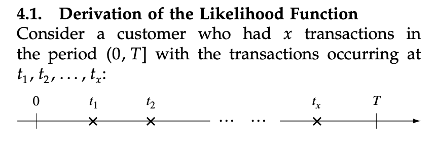
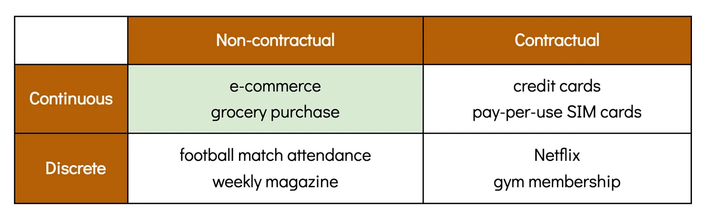

# Recency, Frequency, and Monetary Value

## CLV

- **Customer lifetime value (CLV)** is the total worth of a customer to a company over the length of his relationship.
  - In practice, this “worth” can be defined as _revenue_, _profit_, _purchasing value_ or other metrics of an analyst’s choosing.

### Why CLV is important ?

- The totality of a company’s **CLV** over its **entire customer base** gives a rough idea of its _market value_.
  - Thus, a company with a high total CLV will appear attractive to investors.
- CLV analysis can guide the formulation of **customer acquisition** and **retention** strategies.
  - For example, special attention could be given to high-value customers to ensure that they stay loyal to the company

### CLV Formula

- A customer’s CLV for a given period can be calculated by multiplying two numbers:

  - The customer's predicted **number of transactions** within this period &#8594; _BG-NBD_ model
  - The predicted **value of each purchase**.
    - Option 1: taking average of all past purchases
    - Option 2: Gamma-Gamma model (a more sophisticated probabilistic model, which was also created by the authors of BG-NBD)
    <p align="center"></p>

## R,T,F,M Definition

<p align="center"></p>

- [Recency & T Definition in Lifetimes](https://github.com/CamDavidsonPilon/lifetimes/issues/264): this is to explain why in life times, recency = the age of the latest trans - the first trans.
  - The definition of recency in Lifetimes actually depends on the definition of T.
    - $\text{Recency in Lifetimes} = t_x - t_1$
    - $\text{Actual Recency} = T - \text{Recency in Lifetimes}$
  - T be the age of the customer (or more accurately, time between when we first see them to observation period end)
    - $T = T - t_1$

<p align="center"></p>

- For frequency & monetary value calculation, the [first transaction is always ignored for the RFM calculations](https://github.com/CamDavidsonPilon/lifetimes/issues/208)

```shell
#summary_data_from_transaction_data() aggregates the rows with the same days.

0 1 2017-11-19 100
1 1 2017-11-19 150 - > 2017-11-19 250

2 1 2017-12-19 200
7 1 2017-12-19 300 - > 2017-12-19 500

6 1 2017-12-20 250 - > 2017-12-20 250

#The first transaction is always ignored for the RFM calculations (Only used for T if it's the only transaction).

# Hence you're only left with averaging 500 and 250, with the frequency of 2. Hence 750/2 = 375.5
```

## RFM Analysis

- An RFM analysis is to “bin” each of these values into 5 groups, which are numbered 1 through 5.
- Most common are **quantile based discretization** or binning, and **K-means** clustering.

### Method 1: Quantile based Discretization (Equal Bin)

- The traditional way to assign RFM scores was to take each metric and assign quintile scores from 1 through 5 based on equal bin sizes.
- The disadvantage of this simple binning approach is that customer data are often heavily skewed. Most customer databases tend to have huge numbers of customers who have only ever placed a single order.

  - If 60% of your customers met this criterion, then equal binning would mean that 3000 of them would be assigned R scores from 1 to 3, even though there was actually no difference in the underlying metric.

- Step 1: split the R, F, M scores into 5 quantile

```Python
quantiles = rfm.quantile(q=[0.2, 0.4, 0.6, 0.8])
quantiles = quantiles.to_dict()
def rank_rfm_score(x, p, d):
  # rank 5 is the higest, rank 1 is the lowest
  if x <= d[p][0.2]:
    return 1
  elif x <= d[p][0.4]:
    return 2
  elif x <= d[p][0.6]:
    return 3
  elif x <= d[p][0.8]:
    return 4
  else:
    return 5

segmented_rfm['R_quartile'] =  segmented_rfm['recency'].apply(rank_rfm_score, args=('recency',quantiles))
segmented_rfm['F_quartile'] = segmented_rfm['frequency'].apply(rank_rfm_score, args=('frequency',quantiles))
segmented_rfm['M_quartile'] = segmented_rfm['monetary_value'].apply(rank_rfm_score, args=('monetary_value',quantiles))
```

- Step 2: Create the human freidnly RFM labels based on the combination of RFM scores

```Python
segmented_rfm['rfm_segment'] =  segmented_rfm["R_quartile"].map(str) + segmented_rfm["F_quartile"].map(str) + segmented_rfm["M_quartile"].map(str) # 512, 135
segmented_rfm['rfm_score'] = segmented_rfm[["R_quartile", "F_quartile", "M_quartile"]].sum(axis=1) # 12, 13, 14

# Create human friendly RFM labels: https://documentation.bloomreach.com/engagement/docs/rfm-segmentation
segt_map = {
  r'555': 'Champions',
  r'554': 'Loyal Customers',
  r'544': 'Loyal Customers',
  r'545': 'Loyal Customers',
  r'454': 'Loyal Customers',
  r'455': 'Loyal Customers', 
  r'445': 'Loyal Customers',
  r'543': 'Loyal Customers',
  r'444': 'Loyal Customers',
  r'435': 'Loyal Customers',
  r'355': 'Loyal Customers',
  r'354': 'Loyal Customers',
  r'345': 'Loyal Customers',
  r'344': 'Loyal Customers',
  r'335': 'Loyal Customers',
  r'55[1-3]': 'Potential Loyalists',
  r'54[1-2]': 'Potential Loyalists',
  r'53[1-3]': 'Potential Loyalists',
  r'45[1-3]': 'Potential Loyalists',
  r'44[1-2]': 'Potential Loyalists',
  r'43[1-3]': 'Potential Loyalists',  
  r'423': 'Potential Loyalists',
  r'35[1-3]': 'Potential Loyalists',
  r'34[1-2]': 'Potential Loyalists',
  r'333': 'Potential Loyalists',
  r'323': 'Potential Loyalists',
  r'51[1-2]': 'New Customers',
  r'42[1-2]': 'New Customers',
  r'41[1-2]': 'New Customers',
  r'311': 'New Customers',
  r'52[1-5]': 'Promising',
  r'51[3-5]': 'Promising',
  r'42[4-5]': 'Promising',
  r'41[3-5]': 'Promising',
  r'31[3-5]': 'Promising',
  r'53[4-5]': 'Need Attention',
  r'443': 'Need Attention',
  r'434': 'Need Attention',
  r'343': 'Need Attention',
  r'334': 'Need Attention',
  r'32[4-5]': 'Need Attention',
  r'331': 'About to sleep',
  r'321': 'About to sleep',
  r'312': 'About to sleep',
  r'221': 'About to sleep',
  r'213': 'About to sleep',
  r'2[3-5]1': 'About to sleep',
  r'15[4-5]': 'Can\'t loose them',
  r'144': 'Can\'t loose them',
  r'21[4-5]': 'Can\'t loose them',
  r'11[3-5]': 'Can\'t loose them',
  r'25[2-5]': 'At risk',
  r'24[2-5]': 'At risk',
  r'23[4-5]': 'At risk',
  r'22[4-5]': 'At risk',
  r'15[2-3]': 'At risk',
  r'14[2-3]': 'At risk',
  r'145': 'At risk',
  r'13[3-5]': 'At risk',
  r'12[4-5]': 'At risk',
  r'3[2-3]2': 'Hibernating',
  r'23[2-3]': 'Hibernating',
  r'22[2-3]': 'Hibernating',
  r'132': 'Hibernating',
  r'12[2-3]': 'Hibernating',
  r'21[1-2]': 'Hibernating',
  r'11[1-2]': 'Lost',
  r'1[2-5]1': 'About to sleep',
}
segmented_rfm['rfm_Label'] = segmented_rfm['rfm_Segment'].replace(segt_map, regex=True)

# to view the summary of R, F, M based on the rfm_label
cust_group_summary = segmented_rfm.groupby('rfm_Label').agg(
  total_customers=('recency','count'),
  mean_recency=('recency', 'mean'),
  mean_eff_recency=('eff_recency', 'mean'),
  mean_frequency=('frequency', 'mean'),
  mean_monetary=('monetary_value', 'mean'),
).round(1).sort_values(by='rfm_Label', ascending=False)

# pip install squarify
plt.figure(figsize=(10, 8)) 
ax = squarify.plot(cust_group_summary["total_customers"], label=cust_group_summary.index, 
          color=sns.color_palette("tab20", cust_group_summary.shape[0]), 
          pad=0.5,
          text_kwargs={'fontsize': 14},
          alpha=.8,) 
ax.set_title("Starbucks Customer Segmentation based on RFM Analysis", fontsize=18) 
plt.axis("off")
plt.show()
```

- **Method 2: Unequal binning (K-means)**

  - Rather than simply dividing up each variable into quintiles or segments of equal size, unequal binning aims to segment customers based on the similarity of the data, or specific bounds.
  - Often heavily skewed data you encounter during RFM analysis, you’ll likely need to log transform the data first.
  - Tutorial: [How to assign RFM scores with quantile-based discretization](https://practicaldatascience.co.uk/data-science/how-to-assign-rfm-scores-with-quantile-based-discretization)

- The individual R, F, and M scores are then aggregated to form an overall RFM score, such as 111 or 555. Since 5 x 5 x 5 = 125, this gives a total of 125 different RFM score permutations, such as 111, 153, and 555, each of which describes a segment of customers.
- The RFM model is based on the assumption that customers who have been purchased more recently, have placed more orders, and that customers who spend more money with the business are likely to be more valuable and are more likely to shop again than those that have not.

| RFM Score | Description                                                                                                                                                                                                                                                             |
| --------- | ----------------------------------------------------------------------------------------------------------------------------------------------------------------------------------------------------------------------------------------------------------------------- |
| 111       | Low value customer: A customer who is the least recent, has placed the least number of orders, and has spent the lowest amount. You may want to try and reactivate these, or market to them less frequently.                                                            |
| 511       | New customers: A customer who is the most recent, but has placed the least number of orders, and has spent the lowest amount. To prevent them being one-time customers, these can be targeted to get them to return.                                                    |
| 155       | High value lapsed customer: A customer who is not recent but who has placed a high number of orders and spent a high amount. It would be worthwhile trying to win these repeat customers back.                                                                          |
| 555       | High value customer: A customer who is the most recent, has placed the highest number of orders, and has spent the greatest amount. These big spenders are very valuable and represent your best customers, so will benefit from preferential treatment to retain them. |

## Beta Geometric Negative Binomial Distribution (BG-NBD)

- Many CLV models have been developed with different levels of sophistication and accuracy, ranging from rough heuristics to the use of complex probabilistic frameworks & BG-NBD is one of the most influential models in the domain, thanks to its interpretability and accuracy

### Scope of BG-NBD

- The model is only applicable to **non-contractual**, **continuous purchases**.
- The model only tackles 1 component of CLV calculation, which is the prediction of **the number of purchases**.

<p align="center"><br>The BG-NBD model tackles the non-contractual, continuous situation, which is the most common but most challenging of the four to analyze.</p>

- Under the **non-contractual**, **continuous** setting, customer attrition is not explicitly observable and can happen anytime.
  - This makes it harder to differentiate between customers who have _indefinitely churned_ and those who will return in the future.
  - As we will see later, the BG-NBD model is capable of assigning probabilities to each of these two options.

#### Contractual business vs a Non-contractual business

- A _contractual business_, as its name suggests, is one where the buyer-seller relationship is governed by contracts. When either party no longer wants to continue this relationship, the contract is terminated. Thanks to the contract, there is no ambiguity as to whether someone is a customer of the business at a given point.
- In a _non-contractual business_, on the other hand, purchases are made on a per-need basis without any contract.

#### Continuous and Discrete Settings

- In a _continuous_ setting, purchases can occur at any given moment. The majority of purchase situations (e.g. grocery purchases) fall under this category.
- In a _discrete_ setting, purchases usually occur periodically with some degree of regularity. An example of this is weekly magazine purchase

### Assumptions for BG-NBD

- Each customer has different purchasing rate
- Each customer can stop being your customer at any time
  - At any point, your customer can leave your business for another one a.k.a the **“deactivation” of a previously active customer**.
- To conveniently model a deactivation, we can assume that the _deactivation can only happen after a successful purchase_.
  - That is to say, after every purchase in your store, a customer will decide whether he’ll continue buying at your shop or to abandon it.

## Todo

- [Modeling Customer Lifetime Values with Lifetimes](https://www.aliz.ai/en/blog/part-2-modeling-customer-lifetime-values-with-lifetimes)
- [BTYD Databricks](https://www.databricks.com/notebooks/Customer%20Lifetime%20Value%20Virtual%20Workshop/02%20The%20BTYD%20Models.html)
