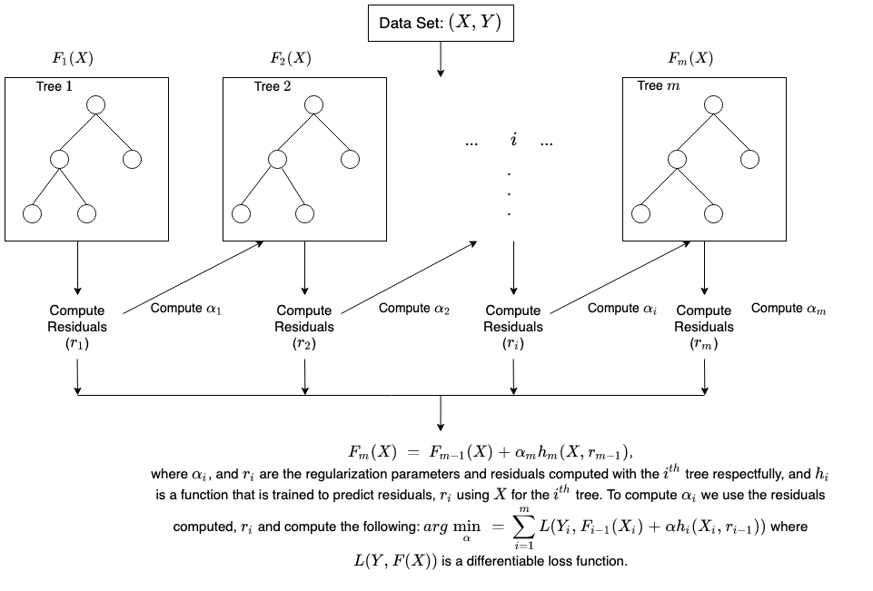

# XGBoost

## Introduction

- eXtreme Gradient Boosting (XGBoost) is a scalable and improved version of the gradient boosting algorithm (terminology alert) designed for efficacy, computational speed and model performance.
- Model Usage: regression, classification, and ranking problems.
- Model Architecture:
  - **Sequential Learning**: XGBoost commonly uses decision trees as its foundational learning. Each subsequent tree is constructed on the previous one's errors, with a focus on misclassified data points. The approach use gradient descent to find the optimal weights for each tree while minimizing the loss function.
  - **Ensemble**: XGBoost generates an ensemble of decision trees and combines their predictions to improve overall accuracy. The final forecast is a weighted sum of all the trees' predictions and weighted based on performance.
- Some of the advantages of using XGBoost over Gradient Boosting are:
  - **Regularization:** - XGBoost Incorporates both L1 (LASSO) and L2 (Ridge) regularization terms in the objective function, providing better control over model complexity.
  - **Parallelization:** XGBoost is optimized for parallel computing, making it more efficient and scalable. This is achieved through parallel tree construction, which is particularly beneficial for large datasets.
  - **Handling Missing Values:** XGBoost can handle missing values internally, reducing the need for explicit imputation.
  - **Tree Pruning:** XGBoost utilizes "max_depth" and "min_child_weight" parameters during tree construction to control the depth and size of trees, enabling more effective pruning.
  - **Cross-validation:** XGBoost has built-in cross-validation capabilities, simplifying the model selection process while cross-validation in gradient boosting needs to be implemented separately.

## How XGboost works

- XGBoost builds an **ensemble** of decision trees, where each tree learns from the errors of the previous trees, and together they create a powerful and accurate predictive model.
- The process of learning from errors and building more trees continues until the model is robust and performs well on new data.
  - **Step 1 - Initialization**: We start with an initial guess for the predictions $F_1(X)$. This can be a simple value like the average of the target values (for regression) or the most common class (for classification).
  - **Step 2 - Calculate Errors**: We calculate the errors between our initial predictions and the actual target values in the training data. $r_1= \text{error metrics} (Y, F_1(X))$
  - **Step 3 - Build a Tree to correct Errors**: Now, we create a decision tree to correct these errors. The tree tries to find patterns in the data that help us make better predictions. $h_1(X, r_1)$
    - $h$ is a function trained to predict the residuals
  - **Step 4 - Update Predictions**: We use the newly created tree to update our predictions.
    - $F_2(X) = F_1(X) + \alpha h_1(X, r_1) $
    - The tree's predictions are combined with the previous predictions, giving more weight to the tree's predictions when they are more accurate.
  - **Step 5 - Repeat for More Trees**: We repeat Steps 2 to 4 to create more trees.
    - Each new tree focuses on correcting the errors that the previous trees couldn't handle.
  - **Step 6 - Stop When Ready**: we repeat this process for a certain number of rounds (boosting rounds) or until the model performs well enough. We want to avoid overfitting, so we stop when the model reaches a satisfactory level of accuracy.
  - **Step 7 - Make Predictions**: once the training is complete, we have a collection of trees that work together to make predictions on new, unseen data. To make a prediction, we pass the new data through each tree, and their combined predictions give us the final result.

<p align="center"></p>

## Code Usage: XGBoost Native vs. XGBoost Sklearn API

- **Objective**: The learning task parameters define the goal of optimization and the metric that will be chosen at each step.
  - `reg:squarederror` regression problem (`xgb.XGBRegressor(objective ='reg:squarederror'`)
  - `binary:logistic` binary classification (the target contains only two classes, i.e., cat or dog)
  - `multi:softmax` multi-class classification (more than two classes in the target, i.e., apple/orange/banana)
- **Early Stopping Round**: when given an unnecessary number of boosting rounds, XGBoost starts to overfit and memorize the dataset (say `n_estimators=3000`). This, in turn, leads to validation performance drop because the model is memorizing instead of generalizing. `early_stopping_rounds` helps to prevent that.
  If value of `early_stopping_rounds` is set to 10 then model will stop the training process if there is no major improvement in the evaluation parameters.
- **Evaluation Metric**: The performance measure.
  - For example, `r2` for regression models, precision for classification models. `auc` (Area under curve) because it performs well with the imbalanced data.
- **Evaluation set**: `X_val` and `y_val` both are used for the evaluation purpose.

### XGBoost Native API `xgboost.train()`

- XGBoost comes with its own class for storing datasets called `DMatrix`.
  - It is a highly optimized class for memory and speed and has the ability to internally deal with categoricals.
  - That's why converting datasets into this format is a **requirement for the native XGBoost API**.

```Python
import xgboost as xgb
# Split the data
X_train, X_test, y_train, y_test = train_test_split(X, y, random_state=2025)

# Extract categorical features
cats = X.select_dtypes(exclude=np.number).columns.tolist()
# Convert to Pandas category
for col in cats:
   X[col] = X[col].astype('category')

# Create regression matrices
dtrain_reg = xgb.DMatrix(X_train, y_train, enable_categorical=True)
dtest_reg = xgb.DMatrix(X_test, y_test, enable_categorical=True)

# Define hyperparameters
params = {
  "objective": "reg:squarederror",
  "tree_method": "gpu_hist"
}

n = 100
model = xgb.train(
   params=params,
   dtrain=dtrain_reg,
   num_boost_round=n,
)
# Evaluation
from sklearn.metrics import mean_squared_error

preds = model.predict(dtest_reg)
rmse = mean_squared_error(y_test, preds, squared=False)

print(f"RMSE of the base model: {rmse:.3f}")
```

### XGBoost Scikit-Learn API: `xgboost.XGBRegressor`, `XGBClassifier`

- XGBoost also offers `XGBClassifier` and `XGBRegressor` classes so that they can be integrated into the **Scikit-Learn** ecosystem

```Python
import xgboost as xgb

# Train a model using the scikit-learn API
clf_xgb = xgb.XGBClassifier(
            n_estimators=100, objective='binary:logistic', tree_method='hist', eta=0.1, max_depth=3, enable_categorical=True
)
# can X_train without encoding
clf_xgb.fit(X_train,
            y_train,
            verbose=False,
            early_stopping_rounds=10,
            eval_metric='auc',
            eval_set=[(X_val, y_val)])

# Convert the model to a native API model
model = clf_xgb.get_booster()
```

## Cross-Validation

- During cross-validation, we are asking XGBoost to watch three classification metrics which report model performance from three different angles.

```Python
# Encode y to numeric
y_encoded = OrdinalEncoder().fit_transform(y)

# Extract text features
cats = X.select_dtypes(exclude=np.number).columns.tolist()

# Convert to pd.Categorical
for col in cats:
   X[col] = X[col].astype('category')

# Split the data
X_train, X_test, y_train, y_test = train_test_split(X, y_encoded, random_state=1, stratify=y_encoded)

# Create classification matrices
dtrain_clf = xgb.DMatrix(X_train, y_train, enable_categorical=True)
dtest_clf = xgb.DMatrix(X_test, y_test, enable_categorical=True)

# This multi:softprob objective also requires the number of classes num_class
params = {"objective": "multi:softprob",
          "num_class": 5,
          "tree_method": "gpu_hist"
}
n = 1000

results = xgb.cv(
   params, dtrain_clf,
   num_boost_round=n,
   nfold=5,
   metrics=["mlogloss", "auc", "merror"],
)
```

- To see the best AUC score, we take the maximum of `test-auc-mean` column:

```Python
# It has the same number of rows as the number of boosting rounds
# Each row is the average metrics of all splits (folds) for that round.
# to get best number of boosting round (before early stopping)
best_num_boost_round = results.shape[0]
best_auc = results['test-auc-mean'].max()
```

## Hyper-parameter Space

- Reference: [XGBoost's parameters](https://xgboost.readthedocs.io/en/stable/parameter.html)
- `booster` [default=gbtree]: This parameter basically selects the type of model to run at each iteration, which gives 2 options
  - `gbtree`: tree-based models
  - `gblinear`: linear models.
- `num_boost_round` (for the native XGBoost interface) (a.k.a `n_estimators` for the Scikit-learn interface) number of trees)
  - The more trees you have, the more reliable your predictions will be, but need to use with `early_stopping_rounds` during `.fit()` to prevent overfitting.
  - How many trees should you pick?
    - Quick result: limit the number of trees to around 200.
    - Model only runs once a week: up to 5,000 trees.
- `eta` regulates how much each tree contributes to the final prediction. The more trees you have, the smaller the learning rate should be.
  - Range: between 0.001 and 0.1.
- `max_depth` decides the complexity of each tree in your model & refers to the maximum depth that a tree can grow to.
  - Range: 1 to 10
- `subsample` controls the amount of data used for building each tree in your model.
  - Range: fraction that ranges from 0 to 1 (recommended: 0.05 and 1)
    - representing the proportion of the dataset to be randomly selected for training each tree.
  - By using only a portion of the data for each tree, the model can benefit from diversity and reduce the correlation between the trees, which may help combat overfitting.
- `colsample_bytree` proportion of features to be considered for each tree.
  - Range: from 0 to 1, where
    - a value of 1 means that all features will be considered for every tree
    - a lower value indicates that only a subset of features will be randomly chosen before building each tree.
- `min_child_weight` sets the minimum sum of instance weights that must be present in a child node in each tree.
  - Range: 1 to 20
- **Note**: hyper-paramters equivalent from native XGBoost interface (`xgboost.train()`) to the Scikit-learn interface (`xgboost.XGBRegressor`, `xgboost.XGBClassifier`)
  - `eta` &#8594; `learning_rate`
  - `lambda` &#8594; reg_lambda
  - `alpha` &#8594; `reg_alpha`
  - `num_boost_round` &#8594; `n_estimators`: are the number of boosting rounds (trees) and they are functionally equivalent, but for different APIs:
    - Use `n_estimators` for the Scikit-learn interface (`xgboost.XGBRegressor`, `xgboost.XGBClassifier`).
    - Use `num_boost_round` for the native XGBoost interface (`xgboost.train()`)

```Python
def objective(trial):
    param = {
        "verbosity": 0,
        "objective": "binary:logistic",
        # use exact for small dataset.
        #"tree_method": "exact",
        'tree_method':'gpu_hist',  # this parameter means using the GPU when training our model to speedup the training process
        # defines booster, gblinear for linear functions.
        "n_estimators": 1000,
        "learning_rate": trial.suggest_float("learning_rate", 1e-3, 0.1, log=True),
        "booster": trial.suggest_categorical("booster", ["gbtree", "gblinear", "dart"]),
        # L2 regularization weight within a logarithmic scale (log=True)
        "lambda": trial.suggest_float("lambda", 1e-8, 1.0, log=True),
        # L1 regularization weight.
        "alpha": trial.suggest_float("alpha", 1e-8, 1.0, log=True),
        # sampling ratio for training data.
        "subsample": trial.suggest_float("subsample", 0.05, 1.0),
        # sampling according to each tree.
        "colsample_bytree": trial.suggest_float("colsample_bytree", 0.2, 1.0),
    }

    if param["booster"] in ["gbtree", "dart"]:
        # maximum depth of the tree, signifies complexity of the tree.
        param["max_depth"] = trial.suggest_int("max_depth", 3, 9, step=2)
        # minimum child weight, larger the term more conservative the tree.
        param["min_child_weight"] = trial.suggest_int("min_child_weight", 2, 10)
        param["eta"] = trial.suggest_float("eta", 1e-8, 1.0, log=True)
        # defines how selective algorithm is.
        param["gamma"] = trial.suggest_float("gamma", 1e-8, 1.0, log=True)
        param["grow_policy"] = trial.suggest_categorical("grow_policy", ["depthwise", "lossguide"])

    if param["booster"] == "dart":
        param["sample_type"] = trial.suggest_categorical("sample_type", ["uniform", "weighted"])
        param["normalize_type"] = trial.suggest_categorical("normalize_type", ["tree", "forest"])
        param["rate_drop"] = trial.suggest_float("rate_drop", 1e-8, 1.0, log=True)
        param["skip_drop"] = trial.suggest_float("skip_drop", 1e-8, 1.0, log=True)

    # Fit the model
    """
    clf_xgb = XGBClassifier(**param, seed=42)
    clf_xgb.fit(X_train_pre,
                y_train,
                verbose=False,
                early_stopping_rounds=10,
                eval_metric='auc',
                eval_set=[(X_val_pre, y_val)])

    # Make predictions
    y_pred_proba = clf_xgb.predict_proba(X_val_pre)[:, 1]
    # Evaluate predictions
    fpr, tpr, thresholds = roc_curve(y_val, y_pred_proba)
    roc_auc = auc(fpr, tpr)
    """
    kfold = StratifiedKFold(n_splits=10, shuffle=True, random_state=2024)
    # follow the cross validation in optuna:
    # https://www.kaggle.com/code/iqbalsyahakbar/ps4e1-3rd-place-solution#CatBoost
    model = XGBClassifier(**param, seed=42)
    roc_auc = np.round(
                    np.mean(
                        cross_val_score(model, X_train_pre, y_train,
                        scoring="roc_auc", cv=kfold)
                    ), 3
                )

    return roc_auc

study = optuna.create_study(direction="maximize")
study.optimize(objective, n_trials=100, timeout=600)

print(f"Number of finished trials: {len(study.trials)}")
print("Best trial:")
trial = study.best_trial

print(f"  Value: {trial.value}")
print("  Params: ")
for key, value in trial.params.items():
    print(f"    {key}: {value}")

```
