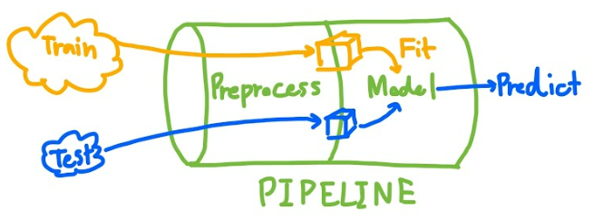
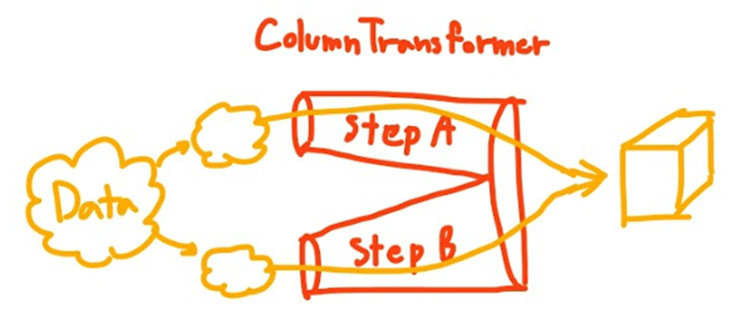

# Scikit-learn Pipeline and ColumnTransformer

## Scikit-learn `Pipeline`

- Before training a model, you should split your data into a training set and a test set. Each dataset will go through the data cleaning and preprocessing steps before you put it in a machine learning model.
- The Scikit-learn `Pipeline` is a tool that links all steps of data manipulation together to create a pipeline. - It is also easier to perform `GridSearchCV` without data leakage from the test set.
<p align="center"></p>

- The `Pipeline` constructor takes a list of (name,estimator) pairs (2-tuples) defining a sequence of steps.

```Python
from sklearn.pipeline import Pipeline

num_pipeline = Pipeline([
    ("impute", SimpleImputer(strategy="median")),
    ("standardize", StandardScaler()),
])
```

- If you don’t want to name the transformers, you can use the `make_pipeline()` function instead

```Python
num_pipeline = make_pipeline(
                OutlierRemover(), # custom transformer
                SimpleImputer(strategy="median"),
                MinMaxScaler()
)
```

## Scikit-learn `ColumnTransformer`

- `ColumnTransformer` will transform each group of dataframe columns separately and combine them later. This is useful in the data preprocessing process.

<p align="center"></p>

- For example, the following `ColumnTransformer` will apply
  - `num_pipeline` (the one which is defined above) to the numerical attributes
  - `cat_pipeline` to the categorical attribute

```Python
from sklearn.compose import ColumnTransformer

num_attribs = ["longitude", "latitude", "housing_median_age", "total_rooms",
               "total_bedrooms", "population", "households", "median_income"]
cat_attribs = ["ocean_proximity"]

cat_pipeline = make_pipeline(
    SimpleImputer(strategy="most_frequent"),
    OneHotEncoder(handle_unknown="ignore"))

preprocessing = ColumnTransformer([
    ("num", num_pipeline, num_attribs),
    ("cat", cat_pipeline, cat_attribs),
    ],
    remainder='passthrough',   # 'drop' and 'passthrough'
    n_jobs=-1)          # n_job = -1 means that we'll be using all processors to run in parallel.
)
```

- If you don’t care about naming the transformers, you can use `make_column_transformer()`

```Python
from sklearn.compose import make_column_selector, make_column_transformer

preprocessing = make_column_transformer(
    (num_pipeline, make_column_selector(dtype_include=np.number)),
    (cat_pipeline, make_column_selector(dtype_include="category")),
    remainder='passthrough',   # 'drop' and 'passthrough'
    n_jobs=-1)          # n_job = -1 means that we'll be using all processors to run in parallel.
)
)
```

- You can get the column names using `preprocessing.get_feature_names_out()` and wrap the data in a nice DataFrame as we did before.

```Python
X = df.drop(columns='Target')
y = df['Target']
# train-test-split
X_train, X_val, y_train, y_val = train_test_split(X, y, test_size=0.2, random_state=42, shuffle=True)
# pre-process with the pipeline
X_train_pre = preprocessing.fit_transform(X_train, y_train)
X_val_pre = preprocessing.transform(X_val)

column_names = preprocessing.get_feature_names_out()

X_train_pre =pd.DataFrame(X_train_pre, columns=column_names)
X_val_pre  = pd.DataFrame(X_val_pre, columns = column_names)
```

### Column Selector

- Since listing all the column names is not very convenient, Scikit-Learn provides a make_column_selector() function that returns a selector function you can use to automatically select all the features of a given type, such as numerical or categorical.

```Python
from sklearn.compose import make_column_selector
selector = make_column_selector(dtype_include=np.number)
selected_columns = selector(df)
selected_columns #  ['city_development_index', 'training_hours']
```

## Custom Transformers

- Although Scikit-Learn provides many useful transformers, you will need to write your own for tasks such as custom transformations, cleanup operations, or combining specific attributes.Although Scikit-Learn provides many useful transformers, you will need to write your own for tasks such as custom transformations, cleanup operations, or combining specific attributes.

### Custom Function Transformer

- For transformations that don’t require any training (i.e. not require `.fit()`), you can just write a **function** that takes a NumPy array as input and outputs the transformed array.
- The `inverse_func` argument is optional. It lets you specify an inverse transform function

```Python
from sklearn.preprocessing import FunctionTransformer

log_transformer = FunctionTransformer(np.log, inverse_func=np.exp)
log_training_hours = log_transformer.transform(df['training_hours'])
log_training_hours[:5]
```

- `FunctionTransformer` is also useful to combine features.
  - For example, here’s a `FunctionTransformer` that computes the ratio between the input features 0 and 1:

```Python
ratio_transformer = FunctionTransformer(lambda X: X[:, [0]] / X[:, [1]])
ratio_transformer.transform(df[["people", "room"]].values)
```

- The transformation function can take hyperparameters as additional arguments

```Python
def diff_mul(X: np.array, multipler: int) -> np.array:
    return (X[:, 0] - X[:, 1]) * multipler

diff_mul_transformer = FunctionTransformer(diff_mul)
diff_mul_transformer.transform(df[['ndp', 'discount']].value,
                               kw_args={"mutliplier": 2}  # provide the "multipler" input to function diff_mul as 2
                            )
```

### Custom Class Transformer

- Custom Class Transformer is to have the transformer with trainable parameters using `fit()` method and using them later in the `transform()` method
- Custom Class Transformer requires:
  - `BaseEstimator` as a base class (and avoid using `*args` and `**kwargs` in your constructor), you will also get two extra methods: `get_params()` and `set_params()`, which will be useful for automatic hyperparameter tuning.
  - `TransformerMixin` as a base class to auto-have `.fit_transform()`
  - Define `fit(X, y)` method with `y=None` as required and it must return `self`
    - Note: `X` should be `np.ndarray` type as if it is in the a step in the Pipeline, the data is passed only with the Numpy array, not Pandas dataframe
  - Define `transformer()` method

```Python
from sklearn.base import BaseEstimator, TransformerMixin
from sklearn.utils.validation import check_array, check_is_fitted
from typing import Union

class StandardScalerClone(BaseEstimator, TransformerMixin):
    def __init__(self, with_mean=True):                 # [REQUIRED] no *args or **kwargs as using BaseEstimator as a base class
        self.with_mean = with_mean

    def fit(self, X: np.ndarray, y: np.ndarray=None):   # [REQUIRED] y is required even though we don't use it
        X = check_array(X)                              # checks that X is an array with finite float values

        self.mean_ = X.mean(axis=0)                     # [REQUIRED] learned attributes have end with "_"
        self.scale_ = X.std(axis=0)
        self.n_features_in_ = X.shape[1]                # [REQUIRED] every estimator stores this in fit()

        return self                                     # [REQUIRED] always return self!

    def transform(self, X: Union[pd.DataFrame, np.ndarray]) -> Union[pd.DataFrame, np.ndarray]:
        check_is_fitted(self)                           # [REQUIRED] looks for learned attributes (with trailing _)
        #self.columns = X.columns

        X = check_array(X)

        assert self.n_features_in_ == X.shape[1]
        if self.with_mean:
            X = X - self.mean_

        return X / self.scale_

    # def get_feature_names_out(self, input_features):
    #     return [col for col in self.columns]

```

## Reference

- [How to Improve Machine Learning Code Quality with Scikit-learn Pipeline and ColumnTransformer](https://www.freecodecamp.org/news/machine-learning-pipeline/)
