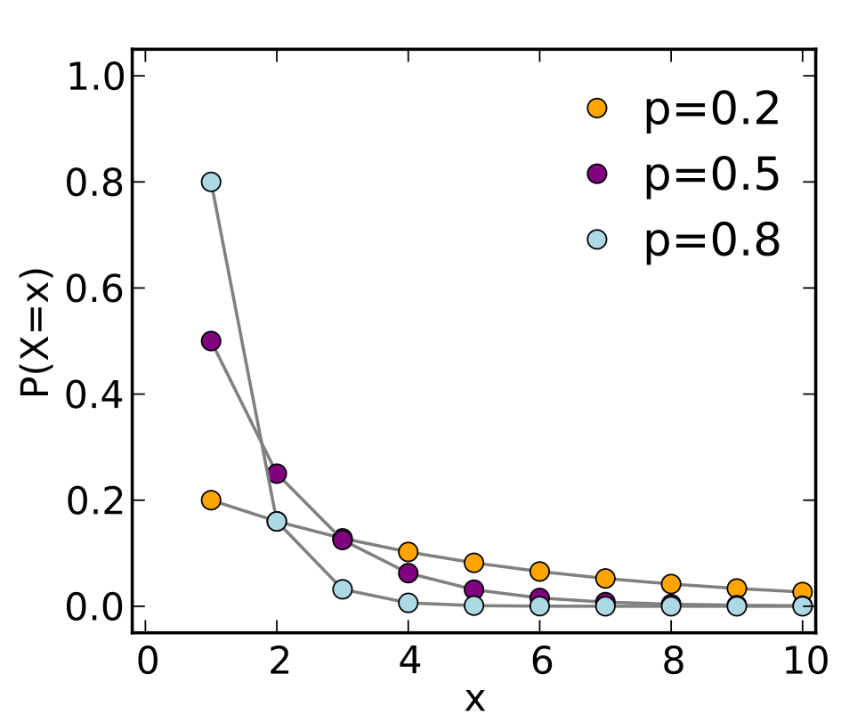

# Geometric Distribution

## Introduction

- A geometric distribution is concerned with the **first success only**. The random variable, X, counts the number of trials required to obtain that first success.
- In a geometric distribution, each event is called a Bernoulli trial.
  - Each Bernoulli trial has two outcomes — success or failure—with a fixed probability.
  - The probability of success in a trial does not change across trials.
  - Each trial is thus independent of past or future trials.
  - This makes a geometric distribution **memoryless** — in other words, an individual trial that is a failure will not improve or reduce the probability of the next trial being a success.

### Shifted Geometric Distribution vs Geometric Distribution

- The geometric distribution is either one of 2 discrete probability distributions:
  - :star: **Shifted** Geometric Distribution: probability distribution of the number $X$ of **Bernoulli trials** needed to get one success, supported on $N = {1,2,3,..}$
  - Geometric Distribution: the probability distribution of the number $Y=X-1$ of **failures** before the first success, supported on $N_0 = {0,1,2,..}$
- The key difference here is that the **shifted** one is the distribution of **number of trials**, while the latter one taking care the distribution of **number of failures** before getting the success.

## (Shifted) Geometric Distribution Formula

- Note: the forumla below is for the probability of first success after **n trials**
- Geometric distribution PMF: $P(X = x) = (1 - p)^{x - 1}p$
- Geometric distribution CDF: $P(X <= x) = 1-(1 - p)^{x}$

### Mean and variance of a Poisson distribution

- The expected value (EV), or the most likely outcome from repeating the trial in a geometric distribution: $E(X)=1/p$.
- The **variance**: $\frac{1-p}{p^2}$

## Examples

- Suppose you are playing a game of darts. The probability of success is 0.4. What is the probability that you will hit the bullseye on the 3rd attempts?
- Solution: As we are looking for the first success, thus, geometric probability distribution has to be used.
  - $p = 0.4$
  - $P(X = 3) = (0.6)^2(0.4) = 0.144$ the probability that you will hit the bullseye on the third try is 0.144
