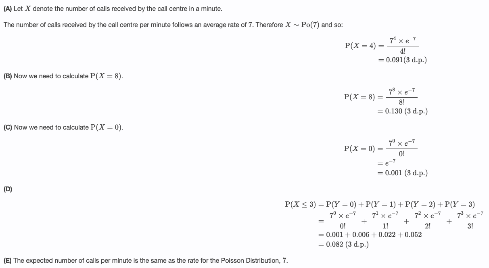

# Poisson Distributions

## Introduction

### What is Poisson distribution

- A **Poisson distribution** is a **discrete** probability distribution that tells the probability of a discrete (i.e., countable) outcome within a given interval of time or space.
  - The Poisson distribution has **only one parameter**, $\lambda$ (lambda), which is the mean number of events in the specific interval.
    - For example: The number of people entering a supermarket per hour, the average number of calls received per minute at a call center.

#### Formula

- The probability mass function of the Poisson distribution is:

$$P(X=k) = \frac{e^{-\lambda}\lambda^{k}}{k!}$$

- Where:
  - $X$ is a random variable following a Poisson distribution
  - $k$ is the number of times an event occurs
  - $P(X = k)$ is the probability that an event will occur k times
  - $e$ is Euler’s constant (approximately 2.718)
  - $\lambda$ is the average number of times an event occurs
  - $!$ is the factorial function

#### Mean and variance of a Poisson distribution

- The **mean** of a Poisson distribution is $\lambda$.
- The **variance** of a Poisson distribution is also $\lambda$.

### Example of Poisson distribution

- Example 1: A video store averaged 400 customers every Friday night, what would have been the probability that 600 customers would come in on any given Friday night?
- Example 2: At a call centre the average number of calls received per minute is 7. Calculate the prob that in the next minute there are:
  - 4 calls
  - 8 calls
  - 0 call
  - At most 3 calls
  - What is the expeceted number of calls in a minute ?

### When to use Poisson distribution

You can use a Poisson distribution if:

- Individual events happen at random and independently. That is, the probability of one event doesn’t affect the probability of another event.
- You know the mean number of events occurring within a given interval of time or space.
  - This number is called $\lambda$ (lambda), and it is assumed to be constant.
