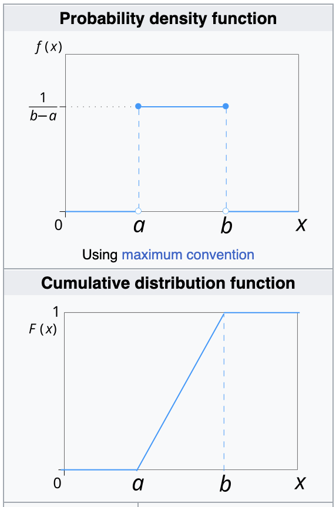

# Distribution Summary

## General

### Bernoulli trials

- Bernoulli Trials are random experiments in probability whose possible outcomes are only of 2 types, such as success and failure, yes and no, True and False, etc.
- For Bernoulli trials, the probability of each outcome remains the same with each trial, i.e., each outcome is independent of the other.
- The process of performing Bernoulli trials is called the **Bernoulli process**.

### PDF vs PMF

- Probability Mass Function (PMF) and the probability density function (PDF) differentiate at
  - PMF is used to describe the probabilities of **discrete** random variables,
  - PDF is used to describe the probabilities of **continuous** random variables.

### PDF, PMF vs CDF

- Cumulative distribution function (CDF)
- Both PDF and PMF can be used to calculate the cumulative distribution function (CDF):
  - The PMF is used to calculate the discrete CDF,
  - The PDF is used to calculate the continuous CDF.
- Example of PMF vs CDF for Geometric Distribution
  - Geometric distribution PMF: $P(X = x) = (1 - p)^{x - 1}p$
  - Geometric distribution CDF: $P(X <= x) = 1-(1 - p)^{x}$

## Discrete

### Discrete Uniform Distribution

### Shifted Geometric Distribution vs Geometric Distribution

- The geometric distribution is either one of 2 discrete probability distributions:
  - :star: **Shifted** Geometric Distribution: probability distribution of the number $X$ of **Bernoulli trials** needed to get one success, supported on $N = {1,2,3,..}$
  - Geometric Distribution: the probability distribution of the number $Y=X-1$ of **failures** before the first success, supported on $N_0 = {0,1,2,..}$
- The key difference here is that the **shifted** one is the distribution of **number of trials**, while the latter one taking care the distribution of **number of failures** before getting the success.

### Binomial vs Geometric Distribution

- **Same**: in both geometric distribution and binomial distribution, there can be only 2 outcomes of a trial, either success or failure.
- **Difference**:

  | Binomial Distribution                                                                                                                                  | Geometric Distribution                                                                                                                                            |
  | ------------------------------------------------------------------------------------------------------------------------------------------------------ | ----------------------------------------------------------------------------------------------------------------------------------------------------------------- |
  | In a binomial distribution, there are a fixed number of trials and the random variable, $X$, counts the **total number of successes in those trials**. | A geometric distribution is concerned with the **first success only**. The random variable, X, counts the number of trials required to obtain that first success. |

### Poisson Distribution as an Approximation to the Binomial Distribution

- When the `n` is large, it can be very tedious and time-consuming to calculate probabilities using the Binomial distribution.
- For a large `n` and small `p`, the the Poisson distribution can be used as an approximation to the Binomial distribution.
- The Poisson approximation to the Binomial distribution has mean $\lambda=np$, where:
  - $n$ number of trials
  - $p$ the probability of success for a Binomial distribution

#### Examples

- Suppose in a small town there are $n=5000$ business and a fire occurs in any given business with probability $p=0.001$ over a decade. What's the probability that there is at most one fire in the next decade?

## Continuous

### Continuous Uniform Distribution

- The bounds are defined by the parameters $a$, $b$ which are the minimum and maximum values.
- The interval can either be closed $[a,b]$ or open $(a,b)$

### Exponential vs Geometric Distribution

- The exponential distribution is the **continuous** version of the geometric distribution.
  | Exponential Distribution | Geometric Distribution |
  | ------------------------------------------------------------------------------------------------------------------------------------------------------ | ----------------------------------------------------------------------------------------------------------------------------------------------------------------- |
  | Represents **the number of Bernoulli trials** needed to achieve the first success. | The exponential distribution is often concerned with the **amount of time until some specific event occurs**. For example, the amount of time (beginning now) until an earthquake occurs has an exponential distribution.|
  |Number of trials needed to get the first success.|Time until the next event occurs in a continuous process.|
